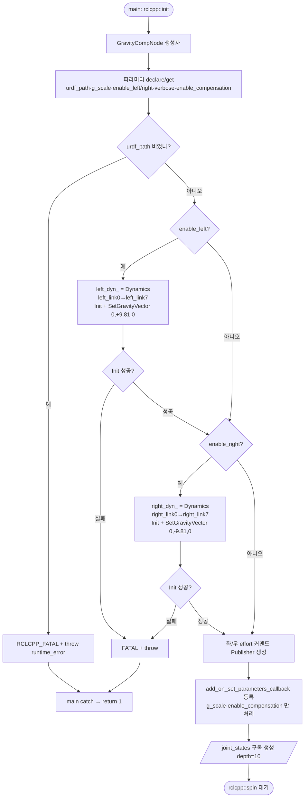
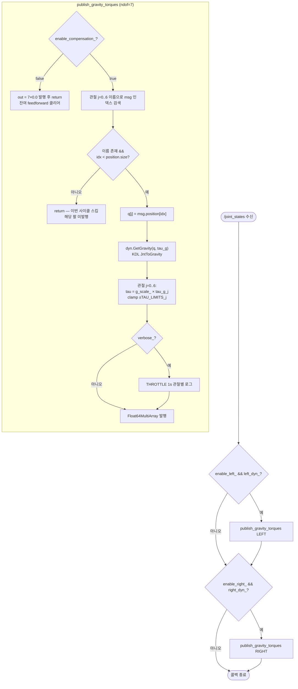
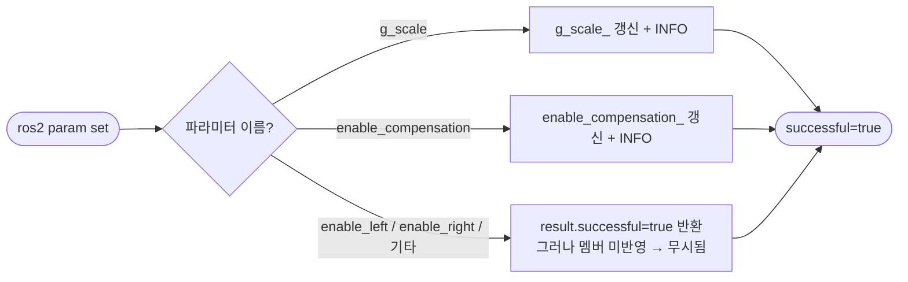

## 2026-06-25 (KST) — openarmx_gravity_comp 리뷰

### 코드 버전
- 리뷰 커밋: `19295f2` (branch `main`) — 대상 파일은 working tree 미수정(커밋 상태 그대로 리뷰)
- 직전 리뷰: 없음(최초)
- 같은 시각 `user_instructions.md` entry: "2026-06-25 22:30 KST — 중력 보상 코드 분석·플로우차트 작성 요청"

### 분석 분기 명시
- 분기: **단위 코드 리뷰** (단일 패키지 `openarmx_gravity_comp` — 노드 1개 + Dynamics 클래스)
- 감지된 도메인: **ros2-review** (rclcpp, package.xml, .launch.py, add_on_set_parameters_callback) / concurrency·embedded 미감지

---

## Core 인벤토리

### 1. 목적

`openarmx_gravity_comp` 는 OpenArmX 양팔(bimanual) 로봇의 **중력 피드포워드(feedforward) 보상** 노드다. MIT(Massachusetts Institute of Technology, 모터 제어 모드) 모드의 순수 PD(Proportional-Derivative) 제어는 적분항이 없어 중력에 의한 정상상태 처짐(약 6°)이 발생한다(README_kr.md:9·24). 본 노드는 `/joint_states` 를 구독하여 매 수신마다 KDL(Kinematics and Dynamics Library) 재귀 뉴턴-오일러로 자세별 중력 토크 `g(q)` 를 실시간 계산하고, `g_scale` 로 스케일·`TAU_LIMITS` 로 클램프한 뒤 `/<side>_forward_effort_controller/commands` 로 발행한다. 이 값이 `forward_command_controller` → `v10_simple_hardware.cpp` write() 의 MIT `τ_ff` 에 주입되어 처짐을 1° 이내로 줄인다(README_kr.md:29·237-239).

구조는 두 층이다: ① ROS2 노드 `GravityCompNode`(구독·계산·발행·런타임 파라미터) — `gravity_comp_node.cpp`, ② KDL 래퍼 `Dynamics` 클래스(URDF 파싱→KDL 체인→`JntToGravity`) — `dynamics.cpp`/`dynamics.hpp`. 좌/우 팔 각각 독립 `Dynamics` 인스턴스를 갖고, base 가 X축 ±90° 장착이라 월드 `-Z` 중력이 link0 에서 Y축이 되는 좌표 규약을 부호로 흡수한다(gravity_comp_node.cpp:33-40).

### 2. 코드 플로우차트

본 패키지는 진입점이 1개(`main`→spin)이고, 동작은 **초기화 1회** + **콜백 반복**으로 나뉜다. 두 경로를 분리한다.

#### 2-A. 초기화 경로 (`GravityCompNode` 생성자)



#### 2-B. 런타임 경로 (`joint_state_callback` → `publish_gravity_torques`, 팔마다 1회)



#### 2-C. 런타임 파라미터 경로 (별도 콜백)



### 3. 함수 리스트

| # | 함수 | 입력 | 출력 | 기능 | 위치 |
|---|------|------|------|------|------|
| 1 | `GravityCompNode::GravityCompNode` | (없음) | — | 파라미터 declare/get, 좌우 Dynamics Init, pub/sub·param 콜백 등록 | gravity_comp_node.cpp:45 |
| 1a | `param_callback_` (람다) | `vector<Parameter>` | `SetParametersResult` | g_scale·enable_compensation 런타임 갱신 | gravity_comp_node.cpp:104 |
| 2 | `GravityCompNode::joint_state_callback` | `JointState::SharedPtr` | void | 좌·우 팔 각각 `publish_gravity_torques` 호출 | gravity_comp_node.cpp:130 |
| 3 | `GravityCompNode::publish_gravity_torques` | msg, joint_names, Dynamics&, pub& | void | 이름매핑→GetGravity→scale·clamp→발행 (comp off 시 0발행) | gravity_comp_node.cpp:140 |
| 4 | `main` | argc, argv | int | init→spin(GravityCompNode)→shutdown, 예외 시 return 1 | gravity_comp_node.cpp:211 |
| 5 | `Dynamics::Dynamics` | urdf_path, start_link, end_link | — | 멤버 경로 저장(파싱은 Init) | dynamics.cpp:17 |
| 6 | `Dynamics::~Dynamics` | (없음) | — | 빈 소멸자 | dynamics.cpp:24 |
| 7 | `Dynamics::Init` | (없음) | bool | URDF 읽기·parseURDF·KDL tree/chain 추출·ChainDynParam 생성 | dynamics.cpp:27 |
| 8 | `Dynamics::SetGravityVector` | gx,gy,gz | void | 중력 벡터 설정 + solver 재생성 | dynamics.cpp:72 |
| 9 | `Dynamics::GetGravity` | q[], gravity[] | void | `JntToGravity` 로 관절별 중력 토크 산출 (**노드 핫패스**) | dynamics.cpp:79 |
| 10 | `Dynamics::GetColiori` | q[], q_dot[], colioli[] | void | 코리올리 토크 (**본 패키지 미사용**) | dynamics.cpp:96 |
| 11 | `Dynamics::GetMassMatrixDiagonal` | q[], inertia_diag[] | void | 관성행렬 대각 (**미사용**) | dynamics.cpp:112 |
| 12 | `Dynamics::GetJacobian` | q[], Eigen::MatrixXd& | void | 자코비안 (매 호출 solver 생성, **미사용**) | dynamics.cpp:128 |
| 13 | `Dynamics::GetNullSpace` | q[], MatrixXd& | void | 영공간 투영(N=I−J⁺J, **미사용**) | dynamics.cpp:148 |
| 14 | `Dynamics::GetNullSpaceTauSpace` | q[], MatrixXd& | void | 토크공간 영공간 Nᵀ (**미사용**) | dynamics.cpp:177 |
| 15 | `Dynamics::GetEECordinate` | q[], R&, p& | void | 말단 FK 포즈 (**미사용**) | dynamics.cpp:205 |
| 16 | `Dynamics::GetPreEECordinate` | q[], R&, p& | void | 직전 세그먼트 FK (**미사용**) | dynamics.cpp:227 |
| 17 | `Dynamics::PrintModelSummary` | (없음) | void | 체인·관성 디버그 출력 (**미사용**) | dynamics.cpp:255 |
| 18 | `Dynamics::NumJoints` | (없음) | size_t | `kdl_chain.getNrOfJoints()` (inline) | dynamics.hpp:76 |
| 19 | `Dynamics::StartLink`/`EndLink` | (없음) | string | 시작/끝 링크명 (inline, **미사용**) | dynamics.hpp:77-78 |
| 20 | `_setup` | LaunchContext | `[Node...]` | xacro→임시 URDF, spawner+gravity_comp_node 구성 | gravity_comp.launch.py:38 |
| 21 | `generate_launch_description` | (없음) | LaunchDescription | g_scale=0.95·enable_left/right 인자 + OpaqueFunction | gravity_comp.launch.py:91 |

### 4. 전역 변수 / 모듈 상수

| # | 사용처(함수) | 기능 | 위치 |
|---|------------|------|------|
| 1 | `LEFT_JOINT_NAMES` (상수) | publish_gravity_torques 이름매핑 키(7) | gravity_comp_node.cpp:20 |
| 2 | `RIGHT_JOINT_NAMES` (상수) | 우팔 이름매핑 키(7) | gravity_comp_node.cpp:25 |
| 3 | `TAU_LIMITS` (상수) | publish_gravity_torques 관절별 토크 클램프 한계 [Nm] | gravity_comp_node.cpp:31 |
| 4 | `RIGHT_ARM_GY` (상수) | 우팔 SetGravityVector Y성분 (−9.81, 물리값과 반대=hw −1 보정 짝) | gravity_comp_node.cpp:39 |
| 5 | `LEFT_ARM_GY` (상수) | 좌팔 SetGravityVector Y성분 (+9.81) | gravity_comp_node.cpp:40 |

가변(mutable) 전역 없음 — 5개 모두 파일 스코프 상수. 노드 상태(`g_scale_`·`enable_*_`·`*_dyn_`)는 멤버 변수로 캡슐화됨(전역 아님).

### 5. 의존성 3-tier

| Tier | 대상 | 버전/제약 | 부재 시 동작(필수/선택) | 근거(파일:line) |
|------|------|----------|----------------------|----------------|
| 빌드 | ament_cmake / rclcpp / sensor_msgs / std_msgs | ROS2 Humble | 빌드 실패 | package.xml:13-19, CMakeLists.txt:11-14 |
| 빌드 | urdf / urdfdom_headers / urdfdom | — | 빌드 실패 | package.xml:17-22 |
| 빌드 | orocos_kdl / kdl_parser | — | 빌드 실패(KDL 핵심) | package.xml:18-21 |
| 빌드 | Eigen3 / eigen3_cmake_module | — | 빌드 실패 | package.xml:24-25 |
| 런타임 필수 | `urdf_path` 파일 | xacro 확장 결과 | 부재→Init 파일오픈 실패→FATAL throw→노드 종료 | gravity_comp_node.cpp:62, dynamics.cpp:29 |
| 런타임 필수 | `/joint_states` 발행자 (joint_state_broadcaster) | sensor_msgs/JointState | 부재→콜백 미호출→토크 미발행(무보상, 무증상) | gravity_comp_node.cpp:121 |
| 런타임 필수 | `left/right_forward_effort_controller` + controller_manager | ros2_control | 부재→발행은 되나 수신처 없음→보상 무효 | gravity_comp.launch.py:60-77 |
| 런타임 필수 | `v10_simple_hardware` write() (dir=−1 적용) | MIT control_mode | 부재/부호변경→τ_ff 부호 오류→역방향 처짐 | v10_simple_hardware.cpp:588·724 |
| 런타임 선택 | `g_scale` 파라미터 | double, default 0.95(launch)/1.05(node) | 미설정→default 적용 | gravity_comp_node.cpp:49, gravity_comp.launch.py:97 |

---

## ROS2 도메인 Add-on

### A-1. Subscriptions

| 토픽 | 메시지 타입 | QoS | 콜백 함수 | 위치 |
|------|-----------|-----|----------|------|
| `/joint_states` | sensor_msgs/JointState | depth 10, **default**(RELIABLE·VOLATILE·KEEP_LAST) | `joint_state_callback` | gravity_comp_node.cpp:121 |

### A-2. Publications

| 토픽 | 메시지 타입 | QoS | 발행 위치(함수) | 위치 |
|------|-----------|-----|---------------|------|
| `/left_forward_effort_controller/commands` | std_msgs/Float64MultiArray | depth 10, default | `publish_gravity_torques` | gravity_comp_node.cpp:94·190 |
| `/right_forward_effort_controller/commands` | std_msgs/Float64MultiArray | depth 10, default | `publish_gravity_torques` | gravity_comp_node.cpp:98·190 |

### A-3. Services / Actions

서비스·액션 서버 없음. 단 `add_on_set_parameters_callback` 로 **파라미터 set 서비스**(`/gravity_comp_node/set_parameters`)가 암묵 노출됨 — g_scale·enable_compensation 만 실제 반영(gravity_comp_node.cpp:103).

### A-4. Parameters

| 이름 | 타입 | default | declare 위치 | 사용 위치 |
|------|------|--------|------------|----------|
| `urdf_path` | string | "" (필수) | :48 | :61 (Dynamics 생성) |
| `g_scale` | double | 1.05 (node) / 0.95 (launch) | :49 | :178 (토크 스케일), 런타임 갱신 :108 |
| `enable_left` | bool | true | :50 | :68·132 (생성자만 — 런타임 무시) |
| `enable_right` | bool | true | :51 | :80·135 (생성자만 — 런타임 무시) |
| `verbose` | bool | false | :52 | :184 (관절별 throttle 로그) |
| `enable_compensation` | bool | true | :53 | :149, 런타임 갱신 :111 |

YAML 예시(단위·물리량 주석):

```yaml
gravity_comp_node:
  ros__parameters:
    # 모델/체인
    urdf_path: "/tmp/v10_gravity_comp.urdf"   # xacro 확장 결과 경로
    # 보상 스케일
    g_scale: 0.95            # 무차원, HIL A/B 최적(2026-06-07). node default 는 1.05
    # 팔 활성 (런타임 변경 불가 — 생성자에서만 평가)
    enable_left: true        # bool
    enable_right: true       # bool
    # 토글/디버그 (런타임 변경 가능)
    enable_compensation: true # bool, false→0 토크 발행
    verbose: false           # bool, 1s throttle 관절별 로그
```

### A-5. TF frames

직접 TF 발행/조회 없음. URDF link 이름(`openarmx_<side>_link0/7`)은 KDL 체인 추출용 문자열로만 사용(gravity_comp_node.cpp:70·82) — tf2 lookup 아님.

### A-6. QoS 호환 매트릭스 (RxO — Requested vs Offered)

| 토픽 | pub(offered) | sub(requested) | 호환 | 비고 |
|------|-------------|----------------|------|------|
| `/joint_states` | joint_state_broadcaster: default RELIABLE | 본 노드: default RELIABLE depth10 | ✅ | broadcaster 가 BEST_EFFORT 로 바뀌면 ❌(무수신·무증상) |
| `/<side>_forward_effort_controller/commands` | 본 노드: default | forward_command_controller: default | ✅ | 양쪽 default → 호환 |

### A-7. 노드 연결 그래프 (rqt_graph 등가)

```text
joint_state_broadcaster --[/joint_states]--> gravity_comp_node
gravity_comp_node --[/left_forward_effort_controller/commands]--> left_forward_effort_controller
gravity_comp_node --[/right_forward_effort_controller/commands]--> right_forward_effort_controller
left/right_forward_effort_controller --(effort cmd if)--> v10_simple_hardware.write() --[MIT τ_ff]--> 모터
```

| 토픽 | 발행 노드 | 구독 노드 | 메시지 타입 | QoS 호환(A-6) |
|------|----------|----------|-----------|--------------|
| `/joint_states` | joint_state_broadcaster | gravity_comp_node | JointState | ✅ |
| `/left_forward_effort_controller/commands` | gravity_comp_node | left_forward_effort_controller | Float64MultiArray | ✅ |
| `/right_forward_effort_controller/commands` | gravity_comp_node | right_forward_effort_controller | Float64MultiArray | ✅ |

- 고아 토픽: 없음(모든 발행에 수신처 존재, 컨트롤러 활성 가정)
- 다중 발행자: 없음
- 외부 경계: `/joint_states`·effort 컨트롤러·하드웨어는 본 패키지 밖(Core 의존성 런타임 필수와 연계)

---

## 평가

severity 분포: Critical 0 / High 0 / Medium 3 / Low 5 / Info 3
Verdict: COMMENT

**함수 #1·#1a `param_callback_` / 생성자 — [param][논리] enable_left·enable_right 런타임 변경 수용되나 무시 (Medium)**
   재현: gravity_comp_node.cpp:104-118 의 람다는 `g_scale`·`enable_compensation` 만 분기. `ros2 param set /gravity_comp_node enable_left false` 호출 시 `result.successful=true` 반환되어 사용자는 적용된 것으로 오인하나, 멤버 `enable_left_`(생성자 :57 에서만 평가)·Dynamics 인스턴스는 불변 → 좌팔 보상 계속 발행. get_parameter 는 새 값(false)을 보고하나 동작은 옛 값 → 파라미터 store 와 실동작 불일치.
   권고: 람다에 enable_left/right 분기를 추가하거나(즉시 Dynamics lazy-init 필요), 두 파라미터를 read-only 로 선언(`ParameterDescriptor.read_only=true`)하여 런타임 변경을 명시적으로 거부.

**함수 #1 생성자 — [param] g_scale default 3중 불일치 (Medium)**
   재현: node default 1.05(gravity_comp_node.cpp:49·194), launch default 0.95(gravity_comp.launch.py:97), README_kr.md:212 는 "현재 최적값 1.05". 메모리(gravity_comp_hil_result)·launch 주석(:93-96)은 HIL 측정상 0.95 채택. 노드를 launch 없이 직접 실행하면 1.05(과보상), launch 경유면 0.95 → 실행 경로별 보상량 상이.
   권고: SSOT 1곳으로 통일(권장 0.95, HIL 근거). node default 도 0.95 로 맞추고 README 갱신.

**함수 #3 `publish_gravity_torques` + 외부 write() — [SOLID] 중력 부호가 hardware direction_multipliers 에 숨은 결합 (Medium)**
   재현: gravity_comp_node.cpp:33-40 은 물리적 link0 중력(우팔 +9.81)과 **반대 부호**(RIGHT_ARM_GY=−9.81)를 설정. 올바른 최종 방향은 오직 v10_simple_hardware.cpp:588·724 의 `param.torque = tau × (−1)` 가 전 관절 −1 을 곱한다는 전제에서만 성립. direction_multipliers 가 한 관절이라도 +1 로 바뀌면(모터 재장착 등) 해당 관절 τ_ff 부호가 반전되어 중력 방향으로 가속 → 위험하나 컴파일·토픽 레벨 무증상.
   권고: 부호 규약을 한쪽(노드 또는 하드웨어)으로 일원화하거나, 두 모듈이 공유하는 부호 상수/주석 cross-ref 를 강제. 최소한 노드 기동 시 가정한 dir 부호를 로그로 표기.

**함수 #9 `GetGravity` — [성능] 콜백마다 JntArray 힙 할당 (Low)**
   재현: dynamics.cpp:84 `KDL::JntArray q_(njoints)` 가 매 /joint_states 콜백(팔당)마다 생성. 핫패스라 할당 빈도 = joint_states rate × 2팔.
   권고: `q_` 를 멤버로 승격하여 재사용(크기 고정 7).

**함수 #3 `publish_gravity_torques` — [성능] 콜백마다 선형 이름 검색 (Low)**
   재현: gravity_comp_node.cpp:159-167, 관절 7개 각각 `std::find` 로 msg->name(14개) 전수 스캔 = 팔당 ~98 비교/콜백. 관절 순서는 정적이므로 1회 해석 후 캐시 가능.
   권고: 첫 성공 매핑 시 `joint_index_cache_[]` 저장, 이후 직접 인덱싱(이름 집합 변동 시만 재해석).

**함수 #10~#17·#19 `Dynamics::GetColiori`/`GetMassMatrixDiagonal`/`GetJacobian`/`GetNullSpace`/`GetNullSpaceTauSpace`/`GetEECordinate`/`GetPreEECordinate`/`PrintModelSummary`/`StartLink`/`EndLink` — [품질] 본 패키지 미사용(dead code) (Low)**
   재현: 노드는 `GetGravity`·`NumJoints`·`SetGravityVector`·`Init` 만 호출. 나머지는 공유 Dynamics 클래스에서 복사된 사용처 없는 메서드(GetJacobian 등은 매 호출 solver 생성 비용까지 내재).
   권고: 본 패키지 전용이면 미사용 메서드 제거, 공유 의도면 별도 공통 라이브러리로 분리해 중복 소스 단일화(teleop_bimanual 의 dynamics.cpp 와 중복).

**Dynamics 클래스 — [품질] 미사용 멤버 + 변수 shadowing (Low)**
   재현: dynamics.hpp:43-48 `q`·`q_d`·`biasangle` 미사용. dynamics.cpp:115 `GetMassMatrixDiagonal` 의 지역 `inertia_matrix` 가 동명 멤버(hpp:42)를 shadowing.
   권고: 미사용 멤버 삭제, 지역/멤버 동명 충돌 해소(지역명 변경).

**함수 #3 `publish_gravity_torques` — [QoS] /joint_states RxO 미검증 의존 (Low)**
   재현: 구독 QoS 가 default(RELIABLE). 실로봇에서 joint_state_broadcaster 가 BEST_EFFORT 로 설정되면 RxO 규칙상 미연결 → 콜백 무호출 → 보상 무증상 정지(A-6).
   권고: 센서류 토픽 관례에 맞춰 SensorDataQoS(BEST_EFFORT) 허용 여부 명시, 또는 기동 후 일정 시간 콜백 미수신 시 경고 로그.

**함수 #2 `joint_state_callback` — [exec] 단일스레드 executor 암묵 가정 (Info)**
   재현: `g_scale_`·`enable_compensation_` 가 param 콜백(쓰기)과 joint 콜백(읽기)에서 공유. `rclcpp::spin`(SingleThreadedExecutor)이라 콜백 직렬화로 안전하나, MultiThreadedExecutor·콜백그룹 도입 시 보호 없음.
   권고: 현상 안전. executor 변경 가능성 있으면 atomic 또는 mutex 명시.

**함수 #2 `joint_state_callback` — [논리] joint_states staleness 가드 없음 (Info)**
   재현: 콜백 구동형이라 broadcaster 정지 시 신규 발행은 멈추나, 컨트롤러는 마지막 τ_ff 를 유지 → 외력으로 자세 변동 시 옛 보상치 잔존 가능.
   권고: 안전 요구 시 msg->header.stamp 기반 staleness watchdog 추가(부재 시 0 토크 페일세이프).

**문서 — [품질] README 참조 파일/경로 불일치 (Info)**
   재현: README_kr.md:94 가 `GRAVITY_COMP_NOTES.md` 를 언급하나 실재하지 않음. README:225 `urdf_path` 예시는 `/tmp/v10_bimanual_gravity.urdf` 이나 launch 실제 경로는 `/tmp/v10_gravity_comp.urdf`(gravity_comp.launch.py:48).
   권고: 누락 문서 생성 또는 참조 삭제, 경로 표기 일치.

---
