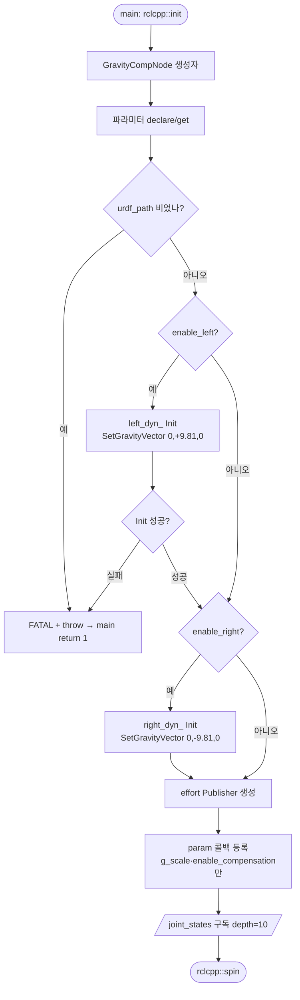
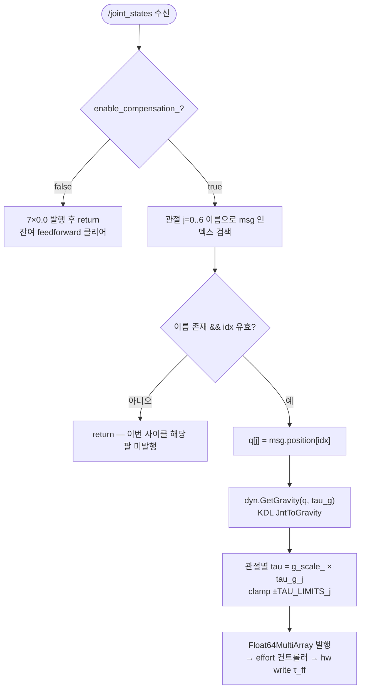
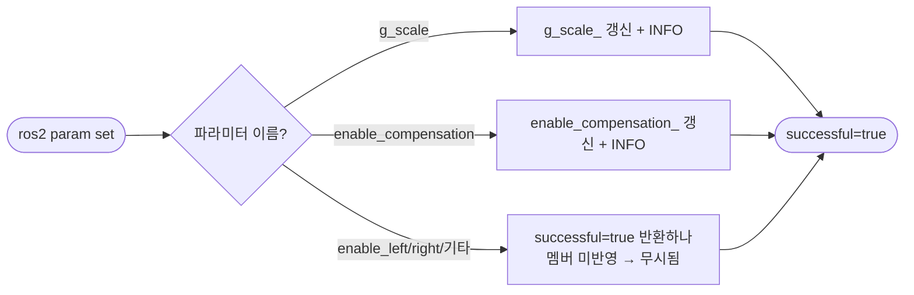

# 중력보상(gravity compensation) 코드 문서

> **대상**: `openarmx_gravity_comp` (OpenArmX 양팔 로봇 중력 피드포워드 보상 노드 + KDL 래퍼)
> **성격**: 코드 이해용 읽기 문서. 상세 결함/severity 는 [코드 리뷰 2026-06-25](2026-06-25.md), 패키지 원본 설명은 [README_kr.md](../../../openarmx_ws/src/openarmx_ros2/openarmx_gravity_comp/README_kr.md) 참조(중복 없이 연결).
> **플로우차트(drawio, 편집용)**: [gravity_comp_flowchart.drawio](gravity_comp_flowchart.drawio) — 3페이지(① 초기화 / ② 런타임 핫패스 / ③ 파라미터 콜백). 아래 Mermaid 와 동일 내용.
> **코드 버전**: branch `main`, HEAD `19295f2`.

---

## 1. 개요 (무엇을 하는가)

MIT(Massachusetts Institute of Technology, 모터 임피던스 제어 모드) 모드의 순수 PD(Proportional-Derivative) 제어는 적분항이 없어 **중력 처짐(약 6°)** 이 생긴다. 본 노드는 `/joint_states` 를 구독해 매 수신마다 KDL(Kinematics and Dynamics Library) 재귀 뉴턴-오일러로 자세별 중력 토크 `g(q)` 를 계산하고, `g_scale` 로 스케일·`TAU_LIMITS` 로 클램프한 뒤 `/<side>_forward_effort_controller/commands` 로 발행한다. 이 값이 하드웨어 write() 의 MIT `τ_ff`(피드포워드 토크)에 주입되어 처짐을 1° 이내로 줄인다.

구조는 2층: ① ROS2 노드 `GravityCompNode`(구독·계산·발행·런타임 파라미터) — `gravity_comp_node.cpp`, ② KDL 래퍼 `Dynamics`(URDF 파싱→KDL 체인→`JntToGravity`) — `dynamics.cpp`/`dynamics.hpp`. 좌·우 팔 각각 독립 `Dynamics` 인스턴스를 갖는다.

## 2. 데이터 체인

```mermaid
flowchart LR
    JS["/joint_states<br/>(14관절 위치)"] --> GN["gravity_comp_node"]
    GN --> DYN["Dynamics.GetGravity(q)<br/>KDL JntToGravity"]
    DYN --> SC["tau = clamp(g_scale × tau_g, ±TAU_LIMITS)"]
    SC --> CMD["/&lt;side&gt;_forward_effort_controller/commands"]
    CMD --> FC["forward_effort_controller"]
    FC --> HW["v10_simple_hardware.write()<br/>param.torque = tau × dir(−1)"]
    HW --> MOT(["팔 모터 τ_ff (좌 7 / 우 7)"])
```

## 3. 플로우차트

### 3-1. 초기화 경로 (생성자)

### 3-2. 런타임 핫패스 (`joint_state_callback` → 팔마다 `publish_gravity_torques`)

### 3-3. 런타임 파라미터 콜백

## 4. 핵심 규약·파라미터

- **부호 규약**: base 가 X축 ±90° 장착이라 월드 `-Z` 중력이 link0 에서 Y축이 된다. 노드는 물리 방향과 **반대 부호**(우팔 `RIGHT_ARM_GY=−9.81`, 좌팔 `+9.81`)를 설정하고, 하드웨어 write() 의 `× direction_multipliers(−1)`(전 관절 −1)가 다시 뒤집어 최종 방향이 맞는다.
- **안전 클램프 `TAU_LIMITS`**: joint1·2=20Nm, joint3·4=7Nm, joint5·6·7=2Nm.
- **파라미터**: `urdf_path`(필수), `g_scale`(스케일; node default 1.05 / launch default 0.95 — §5 M1 불일치), `enable_left`·`enable_right`(생성자에서만 평가 — §5 M2), `verbose`, `enable_compensation`(false→0 토크 발행).

## 5. 알려진 결함 (요약 — 상세는 리뷰 링크)

[코드 리뷰 2026-06-25](2026-06-25.md) 의 Verdict = COMMENT (Critical/High 0, Medium 3 / Low 5 / Info 3). 핵심 Medium 3건:

- **M1 [param]** `g_scale` default 3중 불일치(node 1.05 vs launch 0.95 vs README) → 실행 경로별 보상량 상이.
- **M2 [param/논리]** `enable_left/right` 런타임 param set 이 success 반환하나 무시(생성자에서만 평가).
- **M3 [SOLID]** 중력 부호가 hardware `direction_multipliers(−1)` 에 숨은 결합 — 한 관절이라도 +1 로 바뀌면 역방향 가속, 무증상.

## 6. 참조

- 상세 리뷰(함수표·전역·의존성·ROS2 QoS·severity): [2026-06-25.md](2026-06-25.md)
- 패키지 원본 설명(사용법·잔여오차 분석): [README_kr.md](../../../openarmx_ws/src/openarmx_ros2/openarmx_gravity_comp/README_kr.md)
- 편집용 flowchart: [gravity_comp_flowchart.drawio](gravity_comp_flowchart.drawio)
- 떨림과의 관계(τ_ff 는 처짐만 보정·떨림 무관): [양팔 떨림 구조 분석](../../sw_structure/bimanual_control_tremor/2026-06-29.md)

---
