# 오재미 Pick & Place — 로보틱스 중심 시스템 보고서

> 작성일: 2026-06-25 (KST, Korea Standard Time)
> 대상: OpenArmX 이족(bimanual) 매니퓰레이터의 오재미(soft bean-bag) 집기-놓기 시스템
> 관점: 로보틱스(인지 → 좌표변환 → 운동계획 → 역기구학 → 궤적추종 → 저수준 제어)
> 근거: 본문 각 절의 `파일:라인` 참조. 모든 다이어그램은 Mermaid.

---

## 0. 요약 (TL;DR)

"오재미"는 게임용 **물렁한 콩주머니**다. 코드베이스는 이를 일반화된 **mini-box**(5색: red/yellow/green/blue/orange)로 다루며, 변형되기 쉬운 물체 특성 때문에 **수직 하향(top-down) 파지 + 최소 파지력(effort 1.0)**으로 으깸을 방지한다.

로보틱스 파이프라인은 표준 **sense → plan → act** 구조다:

1. **인지(Sense)** — D435 카메라 + YOLOv8 세그멘테이션이 색별로 마스크를 찾고, 마스크 무게중심을 깊이로 역투영(deprojection)하여 카메라 프레임 3D 점을 만든 뒤, 외부 보정(extrinsic) TF로 로봇 베이스 프레임 `openarmx_body_link0` 좌표 `/detected_boxes`(PoseArray)로 발행한다.
2. **계획(Plan)** — 베이스 프레임 Y 부호로 좌/우 팔 배정(+Y → 왼팔, −Y → 오른팔), 수직 하향 자세를 목표로 **Pinocchio 감쇠 최소자승(DLS, Damped Least Squares) 역기구학(IK, Inverse Kinematics)**을 풀어 7-자유도(DOF, Degrees Of Freedom) 관절각을 얻는다.
3. **실행(Act)** — 다중 경유점(중간 → 접근 → 하강 → 파지 → 상승 → 놓기 → 복귀) 상태기계가 forward-position 컨트롤러와 JointTrajectoryController(JTC)를 교차 전환하며 궤적을 추종한다.

운동 백엔드는 **4종**(cyclo QP+CBF / pilz MoveIt / ptp 직접IK / VLA 학습기반)이 공존하나, **2026-06-09 단일근원(SSOT) 결정**으로 실제 집기-놓기 정본은 **resident Python 경로**(`ptp_pick_resident.py` + `box_detect_loop.py` + `container_pick_gate.py` + UI 브릿지)다.

---

## 1. 시스템 개요 — 계층 아키텍처 (탑다운)

시스템은 응용(UI)에서 모터까지 5개 계층으로 나뉜다. 위 계층은 아래 계층의 **추상화된 능력만** 소비한다.

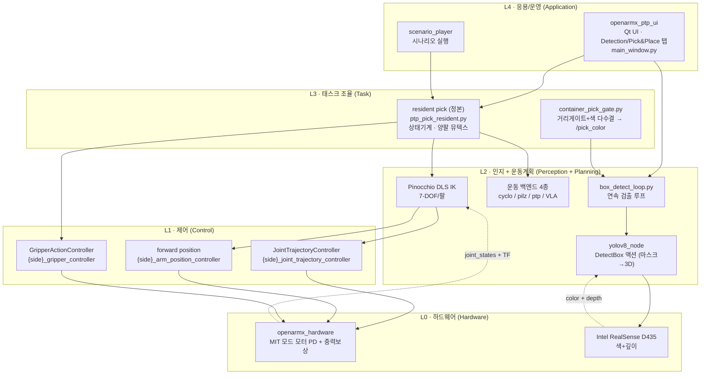

**핵심 설계 원칙**: 인지와 모션의 **엄격한 분리**. 검출 노드는 모션을 모르고(`/detected_boxes`만 발행), 모션 노드는 검출을 모른다(최신 `/detected_boxes`만 소비). 두 책임의 경계는 `openarmx_cyclo_box_align/box_align_node.py:4-17`, `openarmx_ptp_box_align/README.md`에 SSOT로 명시돼 있다.

---

## 2. 대상물·작업 정의 + 좌표계

### 2.1 대상물 — 오재미 (soft mini-box)

| 속성 | 값 | 근거 |
|---|---|---|
| 물체 | 물렁한 콩주머니(오재미), 5색 라벨 | `box_detect_loop.py:24-25` (`mini-box-{red,yellow,green,blue,orange}`) |
| 파지 전략 | 수직 하향(top-down), 자연폭 파지 | `ptp_pick_seq_v2_left.py:121` `R_DOWN` |
| 파지력 | effort = 1.0 (최소) — 으깸 방지 | `ptp_pick_seq_v2_left.py:82` `GRIP_EFFORT` |
| 작업대 높이 | z = 0.72 m (하강 하한) | `ptp_pick_seq_v2_left.py:78` `DESCEND_FLOOR` |
| 물체 상단 | ≈ 0.81 m (책상 0.72 + 약 9 cm) | `ptp_pick_seq_v2_left.py:68` 주석 |

물체가 변형되므로 정밀 6D 포즈 추정 대신 **무게중심(centroid) + 수직 하향 자세**라는 강건한 단순화를 채택했다.

### 2.2 좌표 프레임 / TF 트리

모든 운동 목표는 **베이스 프레임 `openarmx_body_link0`** 기준 절대좌표다. 카메라는 ChArUco 보드 보정으로 얻은 **정적 외부보정(extrinsic) TF**로 베이스에 묶인다.

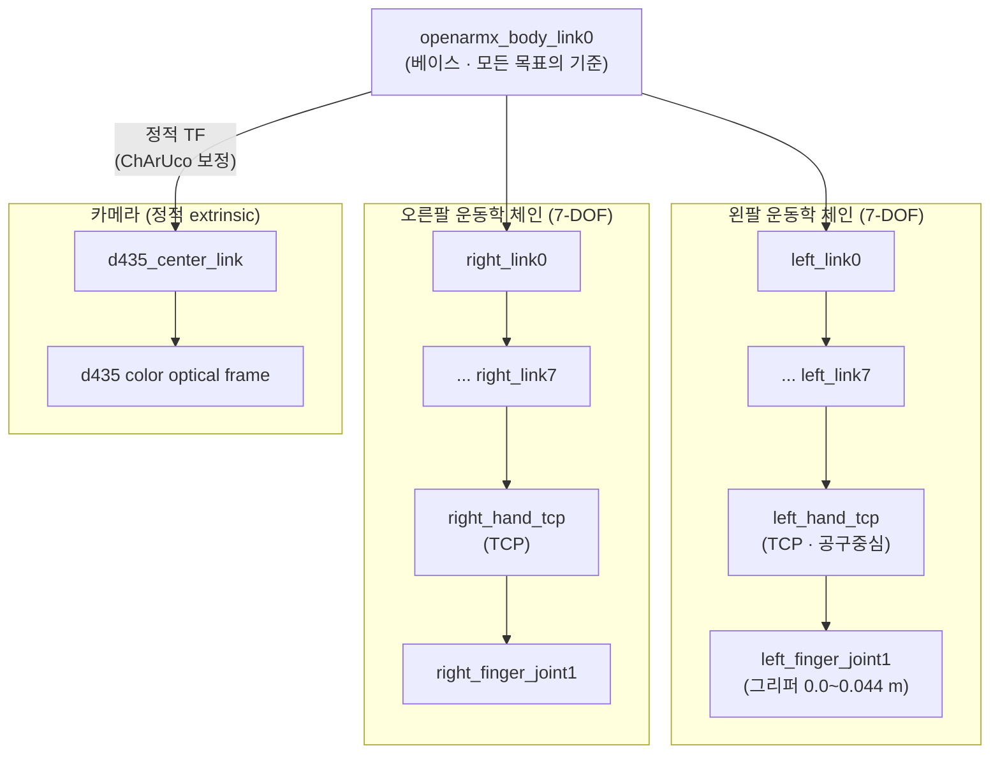

- **베이스 → 카메라**: `body_link0 → d435_center_link` 정적 TF (메모리: D435 Camera Extrinsic, ChArUco Board Setup — 보드와 body_link0 동일 z, 수평 0.59 m).
- **베이스 → TCP**: 운동학 체인을 통해 forward kinematics(FK)/IK로 계산. cyclo는 TCP를 직접 제어하지 못하는 경우 `link7 → hand_tcp` 고정 오프셋을 보정한다 (`box_align_node.py:158-181`, fallback 0.180 m).

---

## 3. 인지 (Perception) — 검출에서 베이스 프레임 3D까지

### 3.1 파이프라인

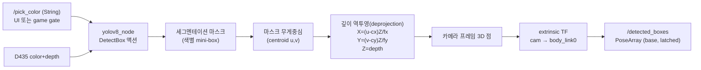

- **검출 엔진**: `yolov8_node`의 on-demand `DetectBox` 액션 (메모리: YOLOv8 Action Server Status). 색 어휘는 5색, confidence 0.4 (`box_detect_loop.py:76-80`).
- **원격 가속 옵션**: mini-box 세그멘테이션을 Pi5 + Hailo-8(non-ROS2 HTTP)로 오프로드하고 `yolo_remote_node`가 `yolov8_node` 드롭인으로 브릿지 (메모리: Remote Hailo Bridge). 추론 31 ms / 비전루프 28 Hz까지 최적화 (메모리: Remote Hailo Pipeline Latency).
- **깊이 디코드 우회**: 이 PC에서 `cv_bridge`의 `imgmsg_to_cv2('bgr8')`가 numpy 2.x/OpenCV skew로 깨져, color는 numpy 직접 디코드로 우회 (메모리: cv_bridge numpy2 Bug).
- **출력 계약**: `/detected_boxes` = `geometry_msgs/PoseArray`, **베이스 프레임**, **latched(transient_local)** QoS — 늦게 뜬 백엔드도 마지막 1개를 받는다 (`box_align_node.py:89-96`).

### 3.2 Sense-Plan-Act 게이팅 (인지↔모션 핸드셰이크)

움직이는 팔이 카메라를 가려 발생하는 오검출을 막고 GPU를 아끼기 위해, **모션 중에는 검출을 멈춘다**. 프로세스 간 파일락(`flock`)으로 구현한다.

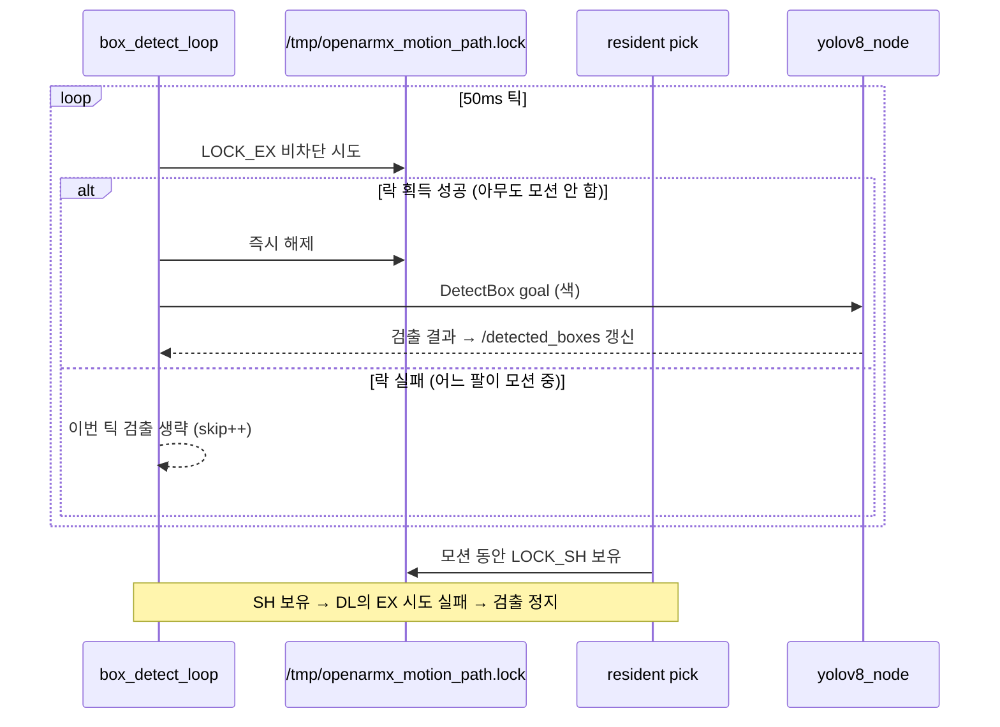

근거: `box_detect_loop.py:52-74`(게이팅), `ptp_pick_resident.py:265-280`(SH 경로락), `ptp_pick_resident.py:301-305`(모션 후 "새" 검출이 와야 다음 픽 — fresh 핸드셰이크).

### 3.3 놓기(Place) 위치 인지

- **place_box_detection** (C++): TOF 센서(USB CSV)로 벽 후보 거리를 잡고, 그 거리에서 D435 포인트클라우드로 수직벽을 검출, HSV로 컨테이너 5색을 판정 (메모리: place_box_detection Package, TOF↔D435 교차검증 Δ<1 mm).
- **container_pick_gate.py**: place 박스 거리 게이트 + 색 다수결로 `/pick_color`를 구동해, "어떤 색을 집을지"를 컨테이너 색에 맞춘다 (메모리: Container Pick Gate).

---

## 4. 계획 (Planning) — 팔 배정 + 파지 자세 + 역기구학

### 4.1 팔 배정 (bimanual assignment)

검출된 각 박스를 **베이스 프레임 Y 부호**로 가까운 팔에 배정한다.

- `+Y → 왼팔(LEFT)`, `−Y → 오른팔(RIGHT)` (`box_align_node.py:278-287`, action 정의 주석).
- 좌측은 +Y 큰 순, 우측은 −Y 작은 순으로 정렬해 각 팔에 가장 가까운 1개를 고른다.
- resident 경로는 자기 측면에서 **min-X**(가장 가까운) 박스 1개를 집는다 (`ptp_pick_resident.py:9-10`).

### 4.2 파지 자세 (grasp pose)

수직 하향이 기본이다. RPY = (roll 180°, pitch 0°, yaw 0°) → 회전행렬

```
R_DOWN = [[ 1,  0,  0],
          [ 0, -1,  0],
          [ 0,  0, -1]]
```

즉 TCP의 접근축(+Z)이 **−Z(아래)**를 향한다 (`ptp_pick_seq_v2_left.py:121`). 자연스러운 약간의 기울임(slanted)을 허용하되 `|pitch| ≤ 55°`(`PITCH_MAX`), `|yaw| ≤ YAW_MAX` 범위의 IK 해만 유효 파지로 수락한다 (`:107-121`, `:369`).

### 4.3 역기구학 — Pinocchio DLS / CLIK 루프

전체 로봇 모델을 latched `/robot_description`(robot_state_publisher가 쓰는 그 모델)에서 로드하고, **반대 팔 관절을 잠가** 각 팔의 축소 모델(7-DOF)을 런타임 생성한다 — 별도 solver URDF가 없어 IK가 실로봇/TF와 어긋날 수 없다 (`ptp_box_align/launch/ptp_box_align.launch.py` 도크스트링, `ptp_pick_seq_v2_left.py:218-224`).

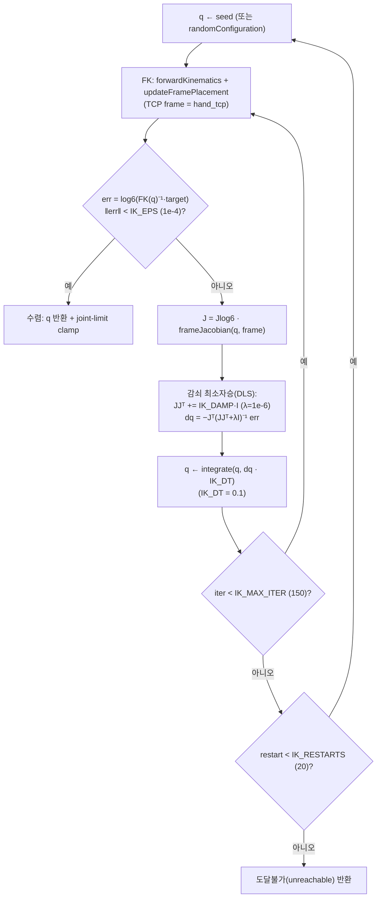

핵심 수식·파라미터 (`ptp_pick_seq_v2_left.py:238-297, 89`):

- 위치 전용 변형: `J = computeFrameJacobian(LOCAL_WORLD_ALIGNED)[:3,:]`, `JJt = J@Jᵀ`, `JJt += IK_DAMP`, `q = integrate(q, Jᵀ·solve(JJt, err)·IK_DT)` (`:243-247`).
- 완전 6D 변형: `J = −Jlog6(iMd⁻¹)@J`, 같은 DLS 갱신 (`:288-295`).
- `IK_EPS=1e-4, IK_MAX_ITER=150, IK_DT=0.1, IK_DAMP=1e-6, IK_RESTARTS=20` (`:89`). MAX_ITER을 1000→150으로 낮춰 비수렴(도달불가) 비용을 6.7배 줄였다(수렴 해는 <100 iter).

### 4.4 자세 결정 전략 (2단 폴백)

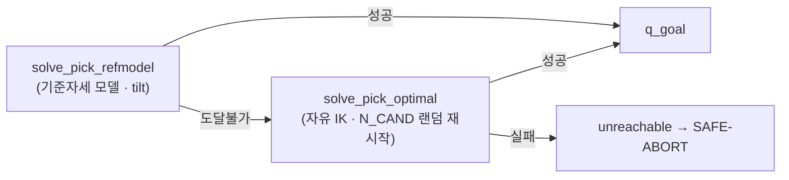

근거: `ptp_pick_resident.py:75-80`. 기준자세 모델(`solve_pick_refmodel`)이 우선, 실패 시 자유 IK(`solve_pick_optimal`, N_CAND=3 랜덤 후보)로 폴백한다.

---

## 5. 운동 백엔드 4종 — 비교

같은 "박스 위로 정렬" 입력을 받아 관절 궤적으로 바꾸는 방식이 4가지다. 의도적으로 **별도 패키지로 유지**(병합 금지)하며, 대상물은 action 메시지 입력으로 일반화한다 (메모리: pick_and_place Backend Separation).

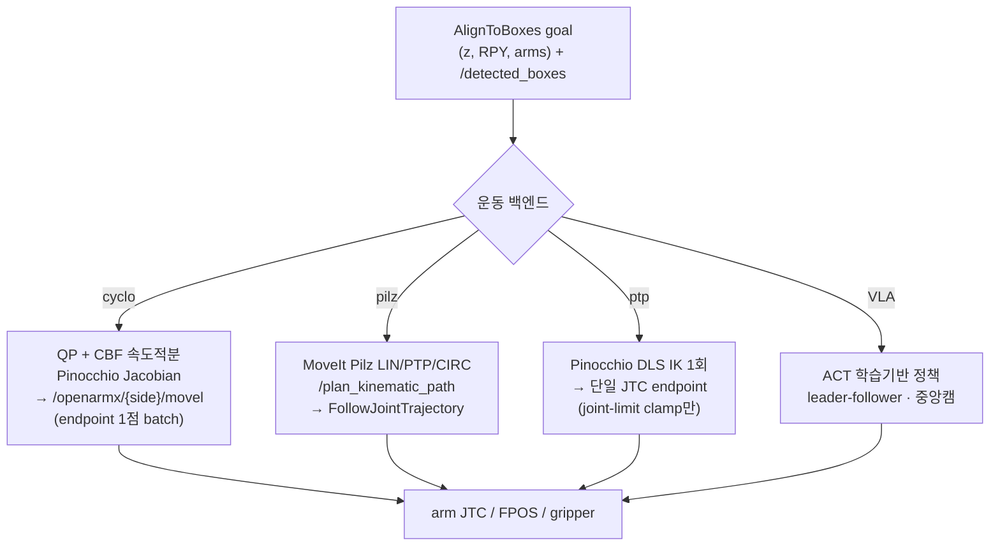

| 백엔드 | 엔진 | 안전 계층 | 제어 기준 | 빌드 부담 | 근거 |
|---|---|---|---|---|---|
| **cyclo** | Pinocchio Jacobian + **QP(2차계획)+CBF(Control Barrier Function)** 속도적분 | 관절한계/특이점/충돌 CBF | TCP (link7→hand_tcp 보정) | cyclo_control 오버레이(C++, OOM 주의) | `box_align_node.py`, README 표 |
| **pilz** | MoveIt Pilz LIN/PTP/CIRC | 완전 MoveIt 충돌계획 | link7 직접 구속 | MoveIt 스택 | `pilz_box_align_node.py:1-20` |
| **ptp** | Pinocchio **DLS IK**, 단일 JTC 끝점 | joint-limit clamp + JTC 자체한계 | TCP(hand_tcp) | `ros-humble-pinocchio`만 | `ptp_box_align/README.md` |
| **VLA(AI)** | **ACT 학습 정책**(lerobot) | 학습 분포 내 | 엔드투엔드 | LeRobot venv(numpy 2.x) | 메모리: AI VLA Backend, LeRobot venv |

**중요한 운동 디테일** — cyclo MoveL 점프의 진짜 원인은 게인이 아니라 **100 Hz 단발 JTC 스트리밍**이었고, endpoint 1점 발행(batch_trajectory)으로 해결했다 (메모리: cyclo MoveL Jump = Streaming Root Cause). 그래서 cyclo/pilz/ptp 모두 "단일 끝점"으로 발행한다.

**정본(canonical)**: 세 box_align 노드는 박스 위 **hover 정렬(디버그)**만 한다. 하강·파지·놓기까지의 end-to-end는 **resident Python 경로**가 소유한다 (`ptp_box_align/README.md` SSOT 2026-06-09). 같은 `controller_manager`를 두 경로가 교차 토글하면 충돌하므로 UI에서 상호배타한다.

---

## 6. 실행 (Act) — Pick & Place 상태기계 (정본 resident 경로)

### 6.1 경유점(waypoint) 상태기계

테이블 충돌을 피하고 top-down 파지를 보장하기 위해 다단 경유점을 거친다.

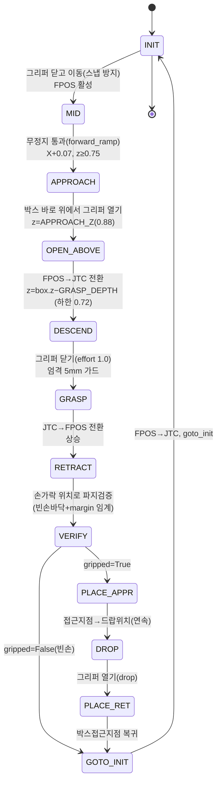

근거: `ptp_pick_resident.py:64-139`(`run_pick` 전체 흐름).

- **경유점 안전 가드**: 하강(실제 파지)은 **엄격 5 mm**, 접근/상승/중간(적응형 경유)은 **느슨 35 mm** 허용오차. NaN 검사, 접근 이동량 > 120° 가드 (`:91-101`).
- **그리퍼 정책**: 이동 중엔 닫아 스냅 방지, 박스 바로 위에서 열고 하강(top-down) (`:111-120`).
- **파지 검증**: 손가락 관절 위치가 캘리브한 빈손 바닥+margin 임계를 넘으면 파지 성공으로 판정 (`:124, :192-205`).
- **기동 캘리브**: 매 기동 시 빈손 닫힘 위치(바닥)를 재측정해 임계를 재설정(재시작 드리프트 흡수) (`:192-205`).

### 6.2 노드 간 시퀀스 (1 픽 사이클)

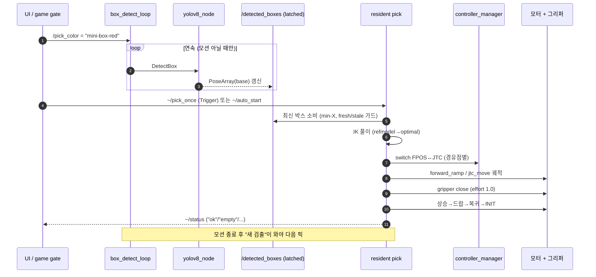

근거: `ptp_pick_resident.py:285-329`(소비/가드/락), `:346-360`(서비스).

---

## 7. 저수준 제어 + 하드웨어

### 7.1 컨트롤러 전환 (mutually exclusive)

한 팔에 대해 **JTC**(`{side}_joint_trajectory_controller`)와 **forward position**(`{side}_arm_position_controller`, FPOS)는 배타적이며 `switch_controller`로 교체한다 (`ptp_pick_seq_v2_left.py:13, 42-43`).

- **forward_ramp** (FPOS): 직전 명령을 seed로 이어받아 경유점을 무정지 통과 — seam 불연속 제거, 워밍업 없이 빠름 (`:485`, `ptp_pick_resident.py:114-115, 127-132`).
- **jtc_move** (JTC): 하강처럼 정밀 단일 끝점 이동에 사용 (`:531`, `JTC_MOVE_TIME=0.8 s`).
- 전환 실패 시 **비활성 컨트롤러에 발행(무동작)을 방지**하고 SAFE-ABORT (`ptp_pick_resident.py:112-118`).

### 7.2 모터 제어 (openarmx_hardware)

- **MIT 모드 PD**: 위치/속도 + KP/KD. 적분이 없어 정적 처짐 발생 → 중력보상으로 보완 (메모리: Motor Gain Tuning Plan).
- **중력보상(gravity compensation)**: 실로봇 검증 OFF 43 mm → ON 9 mm(79%↓), `g_scale=0.95` 채택. effort 컨트롤러 언로드 시 무력화되는 gotcha 주의 (메모리: Gravity Comp HIL Result).
- **속도 제한**: MIT 모드는 LIMIT_SPD/velocity 필드로 못 막음 → 위치 rate-limit + 토크 클램프 + 속도 워치독이 답 (메모리: Motor Speed Limit).
- **떨림(tremor)**: "덜덜덜"은 MIT PD 한계진동(KD×양자화 속도노이즈) + 루프 100→55~68 Hz 저속/지터가 원인 (메모리: JTC Tremor Root Cause).

### 7.3 그리퍼

- `GripperActionController`(`control_msgs/GripperCommand`), finger 범위 **0.0(닫힘) ~ 0.044 m(완전 열림)** (`box_align_node.py:69-70`, `ptp_pick_seq_v2_left.py:79-82`).
- 오재미가 무르므로 파지력 **effort=1.0** 최소 (`:82`). 자연폭으로 잡아 검출도 쉽게 유지.

---

## 8. 통합·실행 (System Integration)

### 8.1 ROS2 노드/토픽/액션 그래프

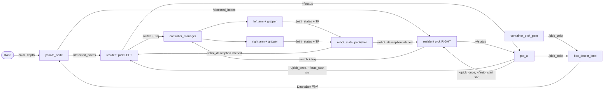

- 좌/우 각 **1개 프로세스**의 resident(모듈 전역 SIDE 때문) — `ptp_pick_resident.py:5, 15`.
- UI는 in-process 액션 호출로 빠르다. UI 느림의 원인은 `ros2 action send_goal` CLI subprocess(~850 ms)를 매번 spawn한 것이었고 in-process(44 ms, 19배↑)로 해결 (메모리: UI Detect CLI Subprocess Bottleneck).

### 8.2 실행/런치

- UI 진입: `ros2 launch openarmx_ptp_ui ptp_pnp_ui.launch.py` (alias `a2_pick_and_place`).
- 서버 묶음: `ptp_pick_servers.launch.py`(resident + box_detect_loop + perception).
- RViz는 stack/UI launch 시 **무조건 함께** 띄운다(메모리: RViz Must Always Spawn).
- **재기동 규칙**: 부분 kill 금지. 노드/UI 재시작은 `kill_all_ros2.sh`로 전체 종료 후 클린 재기동 (메모리: Kill All Before Restart, ROS2 Domain Pollution).

---

## 9. 안전·동시성 (Safety & Concurrency)

로보틱스에서 양팔이 같은 물리 자원(컨트롤러·카메라·작업공간)을 공유하므로, 다층 상호배타가 핵심이다.

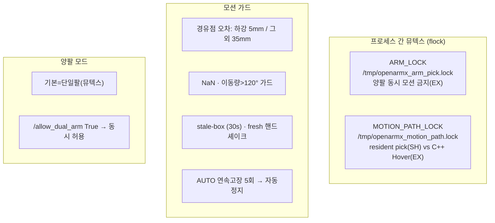

근거: `ptp_pick_resident.py:24-28`(락/임계), `:248-280`(획득/해제), `:91-101`(가드), `:331-344`(watchdog), `:170-172, 245-246`(dual). 운영 토픽에 테스트 publisher 직접 발행 금지 + 죽은 노드 위 실행은 조용히 nan을 부르므로 실행 전 노드/토픽/TF precheck 필수 (메모리: Live Topic Test Pollution, Verify Nodes Before Running).

---

## 10. 부록 — 핵심 파라미터 & 파일 인덱스

### 10.1 핵심 파라미터

| 파라미터 | 값 | 의미 | 파일 |
|---|---|---|---|
| `APPROACH_Z` | 0.88 m | 접근/상승 높이(박스 상단 위) | `ptp_pick_seq_v2_left.py:68` |
| `DESCEND_FLOOR` | 0.72 m | 하강 하한(=책상) | `:78` |
| `GRASP_DEPTH` | 0.01 m | 검출 z 아래로 내리는 깊이 | `:77` |
| `GRIP_OPEN` | 0.044 m | 그리퍼 완전 열림 | `:81` |
| `GRIP_EFFORT` | 1.0 | 파지력(으깸 방지) | `:82` |
| `R_DOWN` / RPY | (180,0,0) | 수직 하향 파지 | `:121` |
| `PITCH_MAX` | 55° | 유효 파지 기울임 한계 | `:111` |
| `IK_EPS / DAMP / DT / ITER / RESTARTS` | 1e-4 / 1e-6 / 0.1 / 150 / 20 | DLS IK 수렴조건 | `:89` |
| `JTC_MOVE_TIME` | 0.8 s | 하강 JTC 시간 | `:94` |
| `arrive_tol_m` | 0.005 m | (cyclo) ee_pose 도달 판정 | `box_align_node.py:74` |
| `AUTO_BOX_MAX_AGE` | 30 s | stale 박스 가드 | `ptp_pick_resident.py:26` |
| `AUTO_FAULT_LIMIT` | 5 | 연속고장 자동정지 | `:28` |

### 10.2 파일 인덱스

| 역할 | 파일 |
|---|---|
| 정본 pick 상태기계 | `openarmx_ws/src/pick_and_place/ptp/openarmx_ptp_pick/openarmx_ptp_pick/ptp_pick_resident.py` |
| IK/시퀀스 코어 | `.../openarmx_ptp_pick/ptp_pick_seq_v2_left.py` |
| 연속 검출 루프 | `.../openarmx_ptp_pick/box_detect_loop.py` |
| 컨테이너 색 게이트 | `.../openarmx_ptp_pick/container_pick_gate.py` |
| cyclo 백엔드(MoveL) | `.../cyclo/openarmx_cyclo_box_align/openarmx_cyclo_box_align/box_align_node.py` |
| pilz 백엔드(MoveIt) | `.../pilz/openarmx_pilz_box_align/openarmx_pilz_box_align/pilz_box_align_node.py` |
| ptp 백엔드(직접 IK) | `.../ptp/openarmx_ptp_box_align/` (+ `README.md`) |
| 액션 정의 | `.../{cyclo,pilz,ptp}/..._msgs/action/AlignToBoxes.action` |
| UI | `.../ptp/openarmx_ptp_ui/openarmx_ptp_ui/main_window.py` |
| place 벽검출(C++) | `.../place_box_detection/` |
| VLA(학습) 백엔드 | `.../pick_and_place/AI/`, `.../TR-AI-Pick/` |

---

### 보고서 범위 메모

- 본 보고서는 **로보틱스 파이프라인(인지→계획→실행→제어) 구조**에 집중한다. 픽셀→3D 역투영의 정확한 내부 구현(카메라 intrinsic 적용)은 `yolov8_node`(`openarmx_ros2` 하위, 본 pick_and_place 패키지 외부)에 있어 본 문서는 그 출력 계약(`/detected_boxes`, base frame)까지만 다뤘다.
- 일부 운동/제어 수치는 코드 직접 인용 + 프로젝트 메모리(실로봇 검증 기록)를 근거로 표기했으며, 각 항에 출처를 명시했다.
