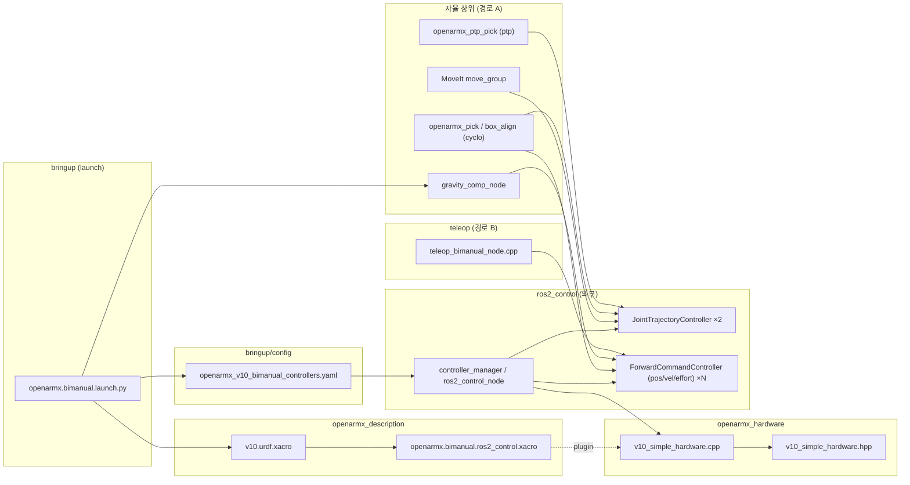
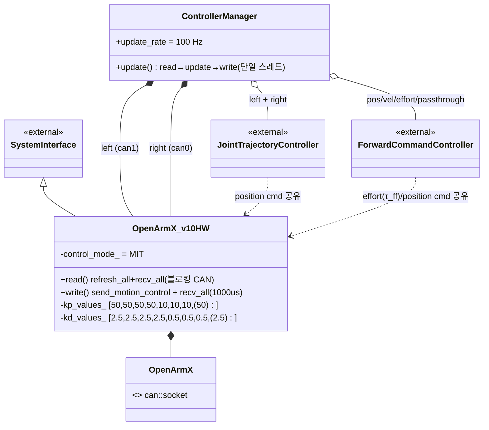
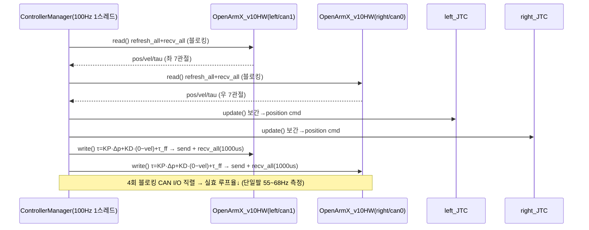
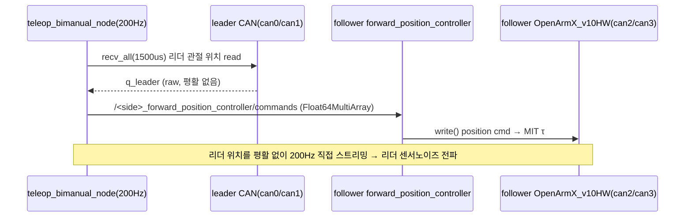

## 2026-06-29 19:30 (KST) — 양팔(bimanual) 제어 떨림 구조 분석 및 해결방안

> 같은 시각 `docs/user_instructions/user_instructions.md` entry: "2026-06-29 19:30 KST — 양팔 제어 떨림 원인·구조 분석 및 해결방안 문서 작성 요청"
>
> 본 문서는 SW(Software) 구조 분석 SOP(Standard Operating Procedure)의 5 산출물(파일 의존 그래프·컴포넌트 관계도·시퀀스 다이어그램·연결 관계표·구조 관찰)로 **연결 구조**를 먼저 보이고, 사용자 요청에 따라 그 위에서 **떨림 원인 진단**과 **해결방안**을 덧붙인다. 진단·해결은 `code_review`/`issue_fix` 소관이며, 기존 분석([2026-06-07 JTC 떨림 진단](../../issues_and_fixes/2026-06-07_jtc_tremor_diagnosis.md), [openarmx_gravity_comp 리뷰](../../code_review/openarmx_gravity_comp/2026-06-25.md))을 양팔 맥락으로 확장한다.

### 분석 범위
- **대상**: OpenArmX V10 양팔 로봇의 저수준 제어 경로 전체 (모터 → 하드웨어 인터페이스 → 컨트롤러 → 상위 명령자)
- **코드 버전**: branch `main`, working tree 기준 (HEAD `afa3b42`). 하드웨어 인터페이스 직전 커밋 `43dc11f`.
- **산출물 분기**: **둘 다** (파일 의존 그래프 + 컴포넌트/클래스 관계도). 절차형 C++ + ROS2 컴포넌트 혼재이므로 ③ 시퀀스 다이어그램은 2개 진입 경로로 분리.
- **두 양팔 제어 경로(진입점 2개)**:
  - **(A) 자율 제어**: MoveIt / cyclo·ptp pick&place → JTC(Joint Trajectory Controller) 또는 position passthrough → `ros2_control`
  - **(B) 텔레오퍼레이션(teleop) 리더-팔로워**: `openarmx_teleop_bimanual` 노드가 리더 팔 위치를 200Hz로 팔로워 `forward_position_controller` 에 스트리밍

---

## ① 파일 의존 그래프



- 외부 라이브러리(`ros2_control`, `rclcpp`, `robstride_motor`)는 그래프에서 제외(rule 7). 단 플러그인 로딩 관계(`controller_manager` → `OpenArmX_v10HW`)는 구조의 핵심이라 표기.
- 점선 `-.plugin.->` = URDF `<plugin>` 선언으로 런타임에 동적 로드(정적 import 아님).

---

## ② 컴포넌트 / 클래스 관계도

핵심은 **단일 `controller_manager`(ros2_control_node) 1개가 좌·우 두 하드웨어 컴포넌트를 동시에 소유**한다는 점이다. 이것이 양팔 떨림의 구조적 핵심이라 별도로 강조한다.



- `<<external>>` = `ros2_control` 기반 클래스. `OpenArmX_v10HW` 는 `SystemInterface` 를 상속(플러그인 export, [v10_simple_hardware.cpp:817-818](../../openarmx_ws/src/openarmx_ros2/openarmx_hardware/src/v10_simple_hardware.cpp#L817-L818)).
- `ControllerManager *-- OpenArmX_v10HW`(구성, 2개): 두 인스턴스(좌/우)는 같은 controller_manager 생명주기에 종속. **같은 `update()` 스레드가 두 컴포넌트의 read()/write()를 순차 호출**.

---

## ③ 시퀀스 다이어그램

### 3-A. 자율 제어 경로 (pick&place, 한 틱 = 10ms 목표)

`ControllerManager::update()` 가 매 틱 좌→우 read, 컨트롤러 update, 좌→우 write 를 **하나의 스레드에서 직렬로** 수행한다. 각 read/write 는 CAN(Controller Area Network) 응답을 동기 대기한다.



### 3-B. 텔레오퍼레이션 경로 (리더-팔로워)



---

## ④ 연결 관계표

| # | source | → | target | 관계 종류 | 위치 |
|---|--------|---|--------|----------|------|
| 1 | openarmx.bimanual.launch.py | → | v10.urdf.xacro | call | [openarmx.bimanual.launch.py:53-72](../../openarmx_ws/src/openarmx_ros2/openarmx_bringup/launch/openarmx.bimanual.launch.py#L53-L72) |
| 2 | openarmx.bimanual.launch.py | → | openarmx_v10_bimanual_controllers.yaml | call | [openarmx.bimanual.launch.py:291-294](../../openarmx_ws/src/openarmx_ros2/openarmx_bringup/launch/openarmx.bimanual.launch.py#L291-L294) |
| 3 | openarmx.bimanual.launch.py | → | gravity_comp_node | call | [openarmx.bimanual.launch.py:178-191](../../openarmx_ws/src/openarmx_ros2/openarmx_bringup/launch/openarmx.bimanual.launch.py#L178-L191) |
| 4 | v10.urdf.xacro | → | openarmx.bimanual.ros2_control.xacro | include | [openarmx.bimanual.ros2_control.xacro:4](../../openarmx_ws/src/openarmx_description/urdf/ros2_control/openarmx.bimanual.ros2_control.xacro#L4) |
| 5 | openarmx.bimanual.ros2_control.xacro | → | v10_simple_hardware.cpp | include | [openarmx.bimanual.ros2_control.xacro:26,78](../../openarmx_ws/src/openarmx_description/urdf/ros2_control/openarmx.bimanual.ros2_control.xacro#L26) (plugin) |
| 6 | v10_simple_hardware.cpp | → | v10_simple_hardware.hpp | include | [v10_simple_hardware.cpp:14](../../openarmx_ws/src/openarmx_ros2/openarmx_hardware/src/v10_simple_hardware.cpp#L14) |
| 7 | OpenArmX_v10HW | → | SystemInterface | inherit | [v10_simple_hardware.cpp:817-818](../../openarmx_ws/src/openarmx_ros2/openarmx_hardware/src/v10_simple_hardware.cpp#L817-L818) |
| 8 | ControllerManager | → | OpenArmX_v10HW (left/can1) | compose | [openarmx.bimanual.ros2_control.xacro:17,27](../../openarmx_ws/src/openarmx_description/urdf/ros2_control/openarmx.bimanual.ros2_control.xacro#L17) |
| 9 | ControllerManager | → | OpenArmX_v10HW (right/can0) | compose | [openarmx.bimanual.ros2_control.xacro:69,79](../../openarmx_ws/src/openarmx_description/urdf/ros2_control/openarmx.bimanual.ros2_control.xacro#L69) |
| 10 | ControllerManager | → | left/right JointTrajectoryController | aggregate | [openarmx_v10_bimanual_controllers.yaml:27,39](../../openarmx_ws/src/openarmx_ros2/openarmx_bringup/config/v10_controllers/openarmx_v10_bimanual_controllers.yaml#L27) |
| 11 | ControllerManager | → | ForwardCommandController (pos/vel/effort/passthrough) | aggregate | [openarmx_v10_bimanual_controllers.yaml:21-57](../../openarmx_ws/src/openarmx_ros2/openarmx_bringup/config/v10_controllers/openarmx_v10_bimanual_controllers.yaml#L21-L57) |
| 12 | OpenArmX_v10HW | → | OpenArmX (can::socket) | compose | [v10_simple_hardware.cpp:227-228](../../openarmx_ws/src/openarmx_ros2/openarmx_hardware/src/v10_simple_hardware.cpp#L227-L228) |
| 13 | JointTrajectoryController | → | OpenArmX_v10HW (position cmd) | depend | [openarmx_v10_bimanual_controllers.yaml:139-143](../../openarmx_ws/src/openarmx_ros2/openarmx_bringup/config/v10_controllers/openarmx_v10_bimanual_controllers.yaml#L139-L143) |
| 14 | gravity_comp_node | → | forward_effort_controller (τ_ff) | depend | [openarmx.bimanual.launch.py:148-157](../../openarmx_ws/src/openarmx_ros2/openarmx_bringup/launch/openarmx.bimanual.launch.py#L148-L157) |
| 15 | MoveIt move_group | → | left/right JTC (FollowJointTrajectory) | call | [moveit_controllers.yaml:27-50](../../openarmx_ws/src/openarmx_ros2/openarmx_bimanual_moveit_config/config/moveit_controllers.yaml#L27-L50) |
| 16 | openarmx_pick (cyclo) | → | JTC / passthrough (batch_trajectory) | call | [openarmx_movel_bimanual.launch.py:84-87](../../openarmx_ws/src/pick_and_place/cyclo/openarmx_pick/launch/openarmx_movel_bimanual.launch.py#L84-L87) |
| 17 | teleop_bimanual_node | → | follower forward_position_controller | call | [teleop_bimanual README:157-158](../../openarmx_ws/src/openarmx_teleop_bimanual/README_kr.md#L157-L158) |
| 18 | teleop_bimanual_node | → | leader/follower CAN (직접 send_motion_control) | call | [teleop_bimanual_node.cpp:260,339](../../openarmx_ws/src/openarmx_teleop_bimanual/src/teleop_bimanual_node.cpp#L260) |

---

## ⑤ 구조 관찰 (사실만, 판정 없음)

- 순환 의존: 순환 없음. (launch → description → hardware → controller_manager 는 단방향)
- 고립 노드: 고립 없음.
- 진입점: 2개.
  - (A) `openarmx.bimanual.launch.py` → `ros2_control_node`(자율) + 상위(MoveIt/cyclo/ptp/gravity_comp)
  - (B) `teleop_bimanual_node.cpp::main`(텔레오퍼레이션, 별도 프로세스·자체 200Hz 루프)
- **fan-in / fan-out 상위** (내부 엣지 18개 ≥ 5):
  - fan-in 최대: `OpenArmX_v10HW`/`v10_simple_hardware.cpp` (#5·#7·#8·#9·#12·#13 = 6) — 모든 제어 경로가 수렴하는 **공통 substrate**
  - fan-out 최대: `openarmx.bimanual.launch.py` (#1·#2·#3 = 3), `ControllerManager` (#8·#9·#10·#11 = 4)
- **구조적 사실(판정 아님)**: 양팔이 **단일 `controller_manager` 1개**에 구성(compose)된다(#8·#9). 즉 좌·우 하드웨어 read()/write()가 동일 `update()` 스레드에서 직렬 실행된다(ros2_control 표준 동작). 좌·우 CAN 버스는 물리적으로 분리(can1/can0)되어 있으나 **소프트웨어 제어 루프는 단일 스레드로 결합**되어 있다.

---

# 떨림 원인 진단 (사용자 요청 — 진단·해결방안)

> 아래는 구조 위에서의 **품질/결함 판정**으로, `code_review`/`issue_fix` 소관이다. 측정값은 [2026-06-07 JTC 떨림 진단](../../issues_and_fixes/2026-06-07_jtc_tremor_diagnosis.md)(rosbag 실측)을 인용하고, 양팔 구조 요인을 추가한다.

## 떨림 = 두 층의 합성

```
[근본 substrate]  모터단 MIT PD 한계진동  ──┐
                                              ├──→  관절 "덜덜덜" 떨림
[양팔 구조 증폭]  단일 루프 직렬화·루프율↓ ──┘
```

### 원인 1 (주원인·공통) — 모터단 MIT 임피던스 PD 한계진동

모든 제어 경로(A·B)가 최종적으로 통과하는 [v10_simple_hardware.cpp:582-591](../../openarmx_ws/src/openarmx_ros2/openarmx_hardware/src/v10_simple_hardware.cpp#L582-L591) write() 의 MIT(Massachusetts Institute of Technology, 모터 임피던스 제어 모드) 토크 식:

```
τ = KP·(pos_cmd − pos) + KD·(vel_cmd − vel) + τ_ff
```

- **무적분(no integral)**: 식에 적분항이 없다. 정상상태 처짐(static droop) 2~5° 발생(실측, 무적분 증거).
- **게인**([v10_simple_hardware.cpp:178-179](../../openarmx_ws/src/openarmx_ros2/openarmx_hardware/src/v10_simple_hardware.cpp#L178-L179)): KP=`{50,50,50,50,10,10,10}`, KD=`{2.5,2.5,2.5,2.5,0.5,0.5,0.5}` (팩토리값).
- **vel_cmd=0**: JTC(Joint Trajectory Controller)·passthrough 모두 `command_interfaces:[position]` 만 발행([openarmx_v10_bimanual_controllers.yaml:140-143](../../openarmx_ws/src/openarmx_ros2/openarmx_bringup/config/v10_controllers/openarmx_v10_bimanual_controllers.yaml#L140-L143)) → KD 항이 `−KD·vel`(순수 측정속도 댐핑)이 됨.
- **양자화 노이즈 증폭**: 측정 vel 은 엔코더 양자화(0.022°=1카운트)를 미분한 값이라 노이즈가 크다. KD가 이 속도 노이즈를 증폭 → 토크 채터 → **한계진동(limit cycle)**.
- **실측 증거(hold 중)**: 위치 p2p 0.022°(고정)인데 속도 ±6~13°/s, 부호반전 ~38회/초(>34Hz 소진폭 버즈). 중력보상 ON/OFF 무관 → 게인/양자화 문제이지 중력보상 탓 아님.

### 원인 2 (양팔 구조 증폭) — 단일 제어루프에 양팔 블로킹 CAN 직렬화

이것이 단일팔 대비 **양팔에서 떨림이 더 심해지는 구조적 이유**다.

- 양팔은 단일 `controller_manager`(ros2_control_node) 1개에 구성된다(구조 관찰 ⑤, #8·#9). ros2_control 의 `update()` 는 단일 스레드에서 **좌 read → 우 read → 컨트롤러 → 좌 write → 우 write** 를 직렬 수행한다.
- read()/write() 둘 다 CAN 응답을 **동기 블로킹** 대기한다: read() 는 `refresh_all()+recv_all()`([v10_simple_hardware.cpp:482-483](../../openarmx_ws/src/openarmx_ros2/openarmx_hardware/src/v10_simple_hardware.cpp#L482-L483)), write() 는 `recv_all(1000)`(=1000μs 대기, [v10_simple_hardware.cpp:670](../../openarmx_ws/src/openarmx_ros2/openarmx_hardware/src/v10_simple_hardware.cpp#L670)).
- **단일팔도 이미** 동기 CAN 으로 설정 100Hz → 실측 55~68Hz, 지터 p99 24ms·간헐 49~338ms 로 떨어진다(실측).
- 양팔은 한 틱에 **블로킹 CAN I/O 가 4회(좌·우 × read·write)** 직렬 발생한다. 좌·우 버스가 물리 분리되어도 단일 스레드라 병렬화되지 못하므로 실효 루프율이 단일팔보다 더 낮아질 구조다(**추론 — 양팔 rosbag 미측정. §검증에서 우선 측정 권고**).
- 루프율↓·지터↑ = MIT PD 안정여유 감소 + 보간 거칠어짐 → 한계진동(원인 1)을 **악화**.

### 원인 3 (명령측) — 속도 피드포워드 부재 / 명령 평활·클램프 부재

- JTC·passthrough 가 vel_cmd 를 안 주므로(원인 1) KD 가 보는 것은 측정 속도 노이즈뿐. 속도 피드포워드(vel_cmd)가 있으면 `KD·(vel_cmd−vel)` 가 의미 있는 댐핑이 되어 채터가 준다.
- write() 경로에 명령 저역통과 필터(LPF)·속도 제한·토크 클램프가 없다(팔 관절 한정; 그리퍼만 stall lock 존재, [v10_simple_hardware.cpp:599-643](../../openarmx_ws/src/openarmx_ros2/openarmx_hardware/src/v10_simple_hardware.cpp#L599-L643)).

### 원인 4 (경로별 추가 요인)

- **(A) 자율 — 과거 100Hz 단발 스트리밍(해결됨)**: cyclo 가 매 틱 1점 궤적을 JTC 에 스트리밍하면 JTC 재계획으로 점프/떨림 발생. cyclo 측 endpoint 1점(batch) 발행으로 해결, 현재 `batch_trajectory:=true` 기본([openarmx_movel_bimanual.launch.py:84-87](../../openarmx_ws/src/pick_and_place/cyclo/openarmx_pick/launch/openarmx_movel_bimanual.launch.py#L84-L87)). 배경 에이전트 재확인: "100Hz 스트리밍은 자유낙하 유발, 단일 궤적 메시지는 아님; 게인 인하는 떨림 악화" → 게인이 아니라 스트리밍 패턴이 원인. **passthrough 직접제어 모드를 다시 매-틱 스트리밍으로 쓰면 재발 위험**.
- **(B) teleop — 200Hz 리더 raw 위치 직접 스트리밍**: `teleop_bimanual_node`(control_rate_hz=200, [teleop_bimanual_node.cpp:49](../../openarmx_ws/src/openarmx_teleop_bimanual/src/teleop_bimanual_node.cpp#L49))가 리더 관절 위치를 **평활 없이** 팔로워 forward_position_controller 로 발행. 리더 센서 노이즈·드래그 미세진동이 그대로 팔로워 setpoint 노이즈가 되어 원인 1 위에 추가 떨림.

### 원인이 아닌 것 (기각)

- **중력보상(gravity_comp)**: τ_ff 는 정상상태 처짐만 줄이고(검증: OFF 43mm→ON 9mm) 떨림과 무관. 떨림은 중력보상 ON/OFF 동일. τ_ff 는 `/joint_states` 수신마다 계산되어 루프율(55~68Hz)에 동기([openarmx_gravity_comp/2026-06-25.md:18](../../code_review/openarmx_gravity_comp/2026-06-25.md)).
- **게인 인상/인하 단독**: 게인 인하는 오히려 떨림 악화(배경 에이전트 실험), 게인은 주 원인이 아님.

---

# 해결방안 (우선순위)

| 우선 | 조치 | 대상 원인 | 변경 위치 | 난이도 | 위험 | 검증 |
|---|---|---|---|---|---|---|
| **P0** | **양팔 루프율 실측 먼저** (단일팔 vs 양팔 헤더 stamp dt) | 원인 2 | 측정만 | 낮음 | 없음 | `analyze_jointstates_tremor.py` 양팔 bag |
| **P1** | **CAN recv 비동기 스레드 분리** — read()의 `recv_all()`을 별도 수신 스레드로, update 스레드는 최신 상태만 읽기 | 원인 2 | `v10_simple_hardware.cpp` read()/write() | 중 | 중(스레드 안전) | 루프율 100Hz+ 회복 확인 |
| **P1** | **속도 피드백 저역통과 필터(LPF)** — KD가 보는 양자화 속도 노이즈 제거 (write() 직전 vel_states 또는 KD 항에 1차 LPF) | 원인 1·3 | `v10_simple_hardware.cpp` write() | 낮음 | 낮음 | hold 토크 채터 FFT 감소 |
| **P2** | **JTC velocity interface 추가** → vel_cmd 공급으로 `KD·(vel_cmd−vel)` 채터 완화 | 원인 1·3 | controllers.yaml `command_interfaces:[position,velocity]` + HW | 중 | 중 | 부호반전율↓ |
| **P2** | **게인 재튜닝 (KP 소폭↓ + KD 적정)** — LPF 도입 후 한계진동 진폭 최소점 탐색 | 원인 1 | `v10_simple_hardware.cpp:178-179` (런타임 param 가능) | 낮음 | 중(처짐↑ 가능) | `joint_gain_tuner.py` |
| **P2** | **teleop 리더 위치 평활 필터** (200Hz 스트리밍 전 LPF/슬루율 제한) | 원인 4B | `teleop_bimanual_node.cpp` | 낮음 | 낮음 | 팔로워 setpoint 노이즈↓ |
| **P3** | **양팔 제어루프 분리** — 좌·우를 namespaced 별도 controller_manager(별 프로세스)로 분리해 직렬화 제거 (launch 의 namespaced 경로 존재: `*_namespaced.yaml`) | 원인 2(근본) | bimanual launch / namespaced yaml | 높음 | 높음(아키텍처) | 좌·우 독립 루프율 |
| **P3** | **(검토) CSP 모드** — 모터단 위치제어로 host PD 채터 회피 (control_mode:=csp 존재). 단 응답·튜닝 재검증 필요 | 원인 1 | `control_mode:=csp` | 중 | 높음(거동 변화) | 별도 실험 |

**권장 순서**: P0(측정) → P1(비동기 CAN + 속도 LPF) 동시 → 재측정 → 남으면 P2. P3 는 P1·P2 로 부족할 때만(아키텍처 변경이라 회귀 위험).

**원칙 준수**: 위 조치는 모두 **미실행 제안**이다. 코드 변경은 사용자 승인(ADR) 후 issue_fix 사이클로 진행한다.

---

# 검증 방법 (재사용)

- 고주파 떨림은 controller_state(35Hz)로 못 본다 → `/joint_states` 속도·토크 + 헤더 stamp dt 로 본다.
- 스크립트: [analyze_jointstates_tremor.py](../../experiments/analyze_jointstates_tremor.py), [analyze_jtc_jitter.py](../../experiments/analyze_jtc_jitter.py), `experiments/joint_gain_tuner.py`.
- **양팔 전용 신규 측정(P0)**: 단일팔 bag vs 양팔 bag 의 `/joint_states` 헤더 stamp dt 중앙값·p99 비교 → 원인 2(직렬화 루프율 저하)를 정량 확인.

---
