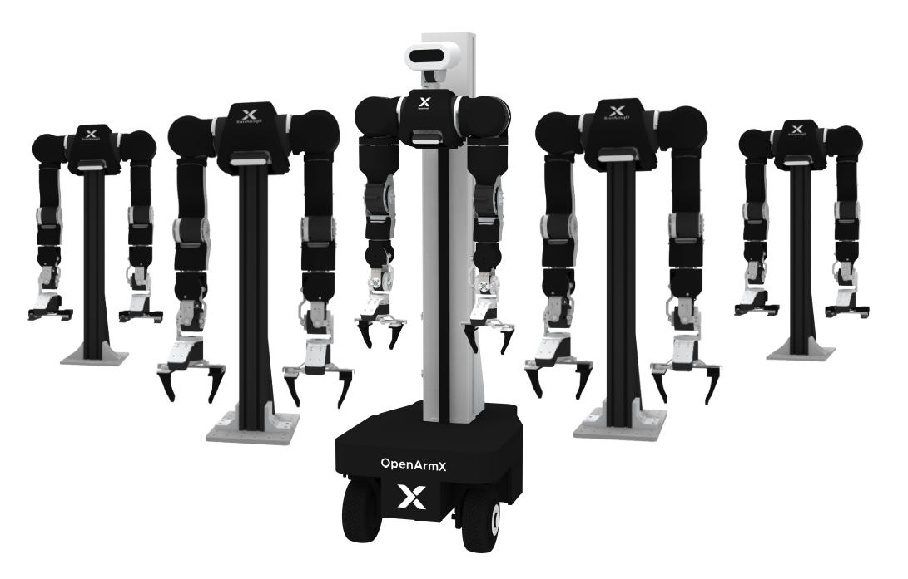

# OpenArmX 빠른 내비게이션

[공식 문서](http://docs.openarmx.com/) | [GitHub 조직](https://github.com/openarmx)

OpenArmX는 Chengdu Changshu Robot Co., Ltd.에서 개발한 오픈소스 듀얼암 협동 로봇 플랫폼으로, ROS 2 기반으로 구축되었습니다. 로봇 본체 기술부터 하위 계층 모터 드라이버, 멀티모달 텔레오퍼레이션, 임바디드 인텔리전스(VLA) 학습 및 추론까지 완전한 기술 스택을 포괄합니다. 본 페이지는 플랫폼 핵심 소프트웨어 패키지의 주요 정보를 요약하여, 개발자가 필요한 모듈을 빠르게 찾을 수 있도록 돕습니다.

---

## 패키지 인덱스

| 패키지명 | 간략한 설명 |
|------|------|
| [openarmx_description](#1-openarmx_description) | 로봇 URDF/Xacro 기술 및 3D 모델 |
| [openarmx_ros2](#2-openarmx_ros2) | ROS 2 코어 라이브러리 및 실행 설정 (메타 패키지) |
| [openarmx_motor_manager](#3-openarmx_motor_manager) | 그래픽 모터 관리 및 CAN 인터페이스 도구 |
| [openarmx_teleop_bimanual](#4-openarmx_teleop_bimanual) | 동형 텔레오퍼레이션 패키지 |
| [openarmx_teleop_exo](#5-openarmx_teleop_exo) | 외골격 디바이스 텔레오퍼레이션 패키지 |
| [openarmx_teleop_vr](#6-openarmx_teleop_vr) | VR 컨트롤러 텔레오퍼레이션 체인 |
| [openarmx_teleop_vr_apk](#7-openarmx_teleop_vr_apk) | VR 디바이스 측 브릿지 APK 설치 패키지 |
| [openarmx_tools](#8-openarmx_tools) | 디버깅, 티칭 및 파라미터 튜닝 도구 모음 |
| [openarmx_vla](#9-openarmx_vla) | VLA 데이터 수집, 모델 학습 및 온라인 추론 |
| [openclaw_skill_openarmx_motion_player](#10-openclaw_skill_openarmx_motion_player) | OpenClaw 자연어 동작 재생 스킬 |

---

## 1. openarmx_description

**개요**
OpenArmX 로봇 플랫폼의 완전한 URDF 기술 패키지로, 정확한 키네매틱스, 다이내믹스, 시각화 모델을 제공합니다. ROS 2 환경에서 모든 시뮬레이션 및 제어 기능의 기반 의존성입니다.

**포함 내용**
- URDF/Xacro 파일: 매니퓰레이터(v10, 7-DOF), 본체, 엔드 이펙터(OpenArmX Hand)의 컴포넌트 기술 및 전체 어셈블리 파일
- 3D 메시 (STL/DAE): 시각화 메시 및 단순화된 충돌 형상
- YAML 설정: 키네매틱스 파라미터(DH), 관절 제한, 링크 관성, 영점 오프셋
- ros2_control 설정: 단일 팔 및 듀얼암 하드웨어 인터페이스 사전 구성 (시뮬레이션/실제 하드웨어 전환 지원)
- RViz 설정 및 시각화 launch 파일

**활용 시나리오**
- 다른 모든 패키지의 URDF 의존성 (MoveIt 플래닝, 하드웨어 드라이버, 텔레오퍼레이션 모두 본 패키지 필요)
- RViz에서 로봇 모델을 독립적으로 시각화하고 키네매틱스 파라미터 검증
- 새로운 로봇 변형이나 엔드 이펙터 추가 시 본 패키지에서 설정 확장

**저장소 링크**
https://github.com/openarmx/openarmx_description

---

## 2. openarmx_ros2

**개요**
OpenArmX의 ROS 2 코어 메타 패키지로, 하위 계층 하드웨어 드라이버, 실행 설정, MoveIt 플래닝 설정을 통합합니다. 실제 매니퓰레이터를 제어하거나 시뮬레이션 환경을 실행하기 위한 주요 진입점입니다.

**포함 내용**
- `openarmx`: 메타 패키지, 코어 컴포넌트 통합
- `openarmx_hardware`: ros2_control 하드웨어 플러그인, CAN 버스를 통해 매니퓰레이터와 그리퍼를 구동
- `openarmx_bringup`: 듀얼암/단일 팔 실행 파일, RViz 설정, 그리퍼 조작 인터페이스
- `openarmx_bimanual_moveit_config`: 듀얼암 MoveIt 2 플래닝 설정
- `openarmx_preview_bringup`: 로봇 관절 모션 프리뷰 제어 패키지
- `openarmx-can_*.deb`: 호환 모터 CAN 드라이버 설치 패키지

**활용 시나리오**
- 실제 OpenArmX 듀얼암 로봇 전원 인가 후 실행 (CAN 모드)
- 시뮬레이션 모드(`use_fake_hardware:=true`)로 소프트웨어 개발 및 테스트
- 텔레오퍼레이션, 도구 패키지 등 상위 모듈의 하위 계층 제어 서비스로 사용

**저장소 링크**
https://github.com/openarmx/openarmx_ros2

---

## 3. openarmx_motor_manager

**개요**
PySide6 기반의 그래픽 데스크톱 도구로, OpenArmX 듀얼암 로봇의 CAN 인터페이스와 모터 상태를 관리하며, 여러 로봇의 동시 관리를 지원합니다.

**포함 내용**
- GUI 메인 프로그램 (`GUI_MultiRobot.py`): 다중 로봇 탭 관리 인터페이스
- CAN 인터페이스 관리: 원클릭 활성화/비활성화, 실제 인터페이스 자동 감지
- 모터 제어: 일괄 활성화/정지, 홈 포지션 복귀, 영점 설정, 단일/전체 모터 테스트 (MIT/CSP 모드)
- 실시간 상태 모니터링: 위치, 속도, 토크, 온도, 결함 상태
- 커맨드라인 스크립트: `scripts/` 아래에 각 작업의 독립 Python 스크립트 제공
- 다국어 지원: 중국어, 영어, 일본어, 러시아어

**활용 시나리오**
- 로봇 최초 전원 인가 후 모터 초기화 및 영점 캘리브레이션
- 일상 유지보수 시 모터 상태 빠른 확인 및 결함 진단
- ROS 2에 의존하지 않는 독립 모터 디버깅 및 테스트

**저장소 링크**
https://github.com/openarmx/openarmx_motor_manager

---

## 4. openarmx_teleop_bimanual

**개요**
ROS 2 텔레오퍼레이션 패키지로, 한 세트의 OpenArmX 매니퓰레이터를 마스터 측으로 사용하여 또 다른 세트를 팔로워 측으로 실시간 구동합니다. 중력 보상 없음(자유 드래그)과 중력 보상 포함(무중력감) 두 모드를 지원합니다.

**포함 내용**
- `teleop_bimanual.launch.py`: 듀얼암 중력 보상 없음 텔레오퍼레이션, 200 Hz 제어 주기, 8-DOF (7 관절 + 그리퍼)
- `teleop_bimanual_with_gravitycomp.launch.py`: URDF 기반 실시간 중력 토크 계산 보상 텔레오퍼레이션
- 중력 보상 파라미터: 보상 스케일 계수, 댐핑 계수, 위치 유지 스티프니스 등 설정 가능
- 모드 전환 지원: `bimanual`, `left_only`, `right_only`

**활용 시나리오**
- 듀얼 로봇 마스터-팔로워 텔레오퍼레이션 데이터 수집 (openarmx_vla와 연동)
- 시연 및 티칭 시나리오에서의 자연스러운 수동 드래그 티칭
- 팔로워 측 컨트롤러 성능과 모션 추종 정밀도 검증

**저장소 링크**
https://github.com/openarmx/openarmx_teleop_bimanual

---

## 5. openarmx_teleop_exo

**개요**
외골격 디바이스를 WebSocket을 통해 ROS 2에 연결하고, 데이터 파싱, 관절 리타게팅 매핑, 안전 브릿징을 거쳐 최종적으로 듀얼암 관절 제어 명령을 출력하여 OpenArmX를 구동합니다.

**포함 내용**
- `websocket_teleoperator`: WebSocket 수신 (기본 포트 19091), 16차원 외골격 관절 명령과 컨트롤러 상태를 퍼블리시. 하드웨어 안전 게이팅 내장 (약 100 Hz)
- `exo_retargeting_node`: YAML 설정 기반 인덱스 매핑, 스케일 계수, 오프셋 각도, 관절 제한 처리
- `exoskeleton_bridge_node`: 최초 접속 시 관절 차이 안전 확인, 부드러운 보간 전환 (기본 3 s / 50 Hz). 통과 후 실시간 포워딩으로 진입
- `exoskeleton_display.launch.py`: RViz 외골격 모델 시각화
- 지원 로봇 타입: `OpenArm`, `OpenArmX` (YAML 설정으로 전환)

**활용 시나리오**
- Qnbot 등 외골격 디바이스를 연결한 인간-로봇 협동 텔레오퍼레이션
- 외골격 가이드 듀얼암 모션 데이터 수집으로 모델 학습 활용
- 외골격과 로봇 관절 매핑 관계의 디버깅 및 캘리브레이션

**저장소 링크**
https://github.com/openarmx/openarmx_teleop_exo

---

## 6. openarmx_teleop_vr

**개요**
VR 텔레오퍼레이션 완전 체인으로, C++ UDP 브릿지 패키지와 Python IK 텔레오퍼레이션 패키지를 포함합니다. VR/OpenXR 컨트롤러 데이터를 듀얼암 관절 제어 명령으로 변환합니다.

**포함 내용**
- `openarmx_teleop_bridge_vr` (C++): UDP 포트 5100 수신, 컨트롤러 포즈, 트리거, 그립 등 ROS 2 토픽 퍼블리시, TF 퍼블리시 선택 가능
- `openarmx_teleop_vr` (Python): 브릿지 토픽 구독, IK 계산 및 제약 처리 수행, 듀얼암 `forward_position_controller` 명령 출력
- Pico, Meta Quest 등 주요 VR 디바이스 지원 (openarmx_teleop_vr_apk와 연동)

**활용 시나리오**
- VR HMD 몰입형 OpenArmX 듀얼암 텔레오퍼레이션
- openarmx_vla와 연동한 고품질 VR 텔레오퍼레이션 티칭 데이터 수집
- IK 알고리즘과 말단 포즈 추적 정밀도 검증

**저장소 링크**
https://github.com/openarmx/openarmx_teleop_vr

---

## 7. openarmx_teleop_vr_apk

**개요**
VR 디바이스 측 브릿지 애플리케이션의 APK 설치 패키지 저장소로, VR 컨트롤러 데이터를 openarmx_teleop_bridge_vr로 포워딩하는 클라이언트 애플리케이션을 집중 배포합니다.

**포함 내용**
- `openarmx-vr-pico.apk`: Pico 시리즈 디바이스용 브릿지 APK
- Meta Quest 호환 APK
- ADB 설치 안내 (개발자 모드 활성화, USB 디버깅, adb install 절차)

**활용 시나리오**
- VR 텔레오퍼레이션 환경 최초 설정 시 디바이스 측 브릿지 소프트웨어 설치
- Pico 또는 Meta Quest 디바이스의 브릿지 애플리케이션 버전 업데이트

**저장소 링크**
https://github.com/openarmx/openarmx_teleop_vr_apk

---

## 8. openarmx_tools

**개요**
엔지니어링 디버깅과 티칭을 위한 도구 모음 패키지로, 각 서브 패키지는 독립적으로 빌드 및 사용할 수 있으며, 관절 제어, 그리퍼 디버깅, 파라미터 튜닝, 궤적 녹화/재생의 전 과정을 포괄합니다.

**포함 내용**
- `openarmx_joint_slider_panel`: RViz2 듀얼암 관절 슬라이더 패널, 분할 스텝 실행 지원
- `openarmx_gripper_panel`: RViz2 그리퍼 제어 패널, 단일/듀얼 그리퍼 동기 제어 지원 (GripperCommand action)
- `openarmx_kp_kd_panel`: RViz2 KP/KD 실시간 파라미터 조절 패널, 실기 강성/댐핑 튜닝에 적합
- `openarmx_teach`: 궤적 티칭 도구, `/joint_states`에서 YAML 궤적을 녹화하고 재생, 관절 필터링 및 속도 스케일링 지원

**활용 시나리오**
- 실기 디버깅 시 각 관절 모션과 그리퍼 동작 빠른 검증
- 컨트롤러 온라인 전 KP/KD 파라미터 튜닝
- 프로그래밍 없이 티칭 궤적 녹화 및 반복 재생 검증

**저장소 링크**
https://github.com/openarmx/openarmx_tools

---

## 9. openarmx_vla

**개요**
LeRobot 프레임워크 기반의 임바디드 인텔리전스(VLA) 엔드투엔드 워크플로우로, 멀티 카메라 텔레오퍼레이션 데이터 수집, ACT 모델 학습부터 온라인 추론까지의 전 과정을 포괄합니다.

**포함 내용**
- 데이터 수집 플로우 (`lerobot-record`): 3채널 RealSense 카메라(D405/D435), VR 텔레오퍼레이션 동기 녹화 지원
- GUI 원클릭 실행 스크립트 (`scripts/vla_collect_gui.sh`): 순서대로 로봇 하위 계층, 카메라 퍼블리시, 데이터 수집 각 터미널 자동 기동
- 통합 설정 파일 (`config/vla_collect.env`): 카메라 파라미터, 데이터셋 이름, 해상도/프레임 레이트 등 일괄 관리
- ACT 학습 명령: 단일 GPU 및 다중 GPU (torchrun) 학습 지원
- 추론 플로우: 산업 PC + 추론 머신 듀얼 머신 협업, ROS_DOMAIN_ID 동기 설정 안내

**활용 시나리오**
- VR 텔레오퍼레이션 듀얼암 조작 티칭 데이터셋 수집
- 독립 GPU 서버에서 ACT 등 모방 학습 정책 모델 학습
- 학습된 모델을 로봇에 배포하여 온라인 자율 추론 검증

**저장소 링크**
https://github.com/openarmx/openarmx_vla

---

## 10. openclaw_skill_openarmx_motion_player

**개요**
OpenClaw 플랫폼용 OpenArmX 동작 재생 스킬로, 사용자가 자연어로 동작 이름을 지정하면 스킬이 자동으로 궤적 파일을 매칭하고 bringup을 관리하며 로봇을 구동해 재생합니다.

**포함 내용**
- 자연어 동작명 매칭 로직: `openarmx_teach/motions` 디렉터리의 YAML 궤적 파일 스캔
- bringup 자동 확인 및 재사용: 중복 실행 방지, 실기 모드에서 새 bringup 실행 시에만 기본 KP/KD 적용
- `play_joint_trajectory` 호출 래핑: `left/right_joint_trajectory_controller` 및 그리퍼 action 인터페이스 연동
- 예제 궤적 (`motions/`) 및 원클릭 설치 스크립트 (`scripts/install_demo_motions.sh`)
- 이중 설치 방식: 수동 직접 배포 또는 OpenClaw가 `DEPLOY_WITH_OPENCLAW.md`에 따라 자동 실행

**활용 시나리오**
- OpenClaw 대화 인터페이스에서 자연어로 사전 녹화된 매니퓰레이터 동작 트리거
- `openarmx_teach`에서 녹화한 궤적이 정상적으로 재생 가능한지 빠른 검증
- 시연 또는 생산 라인 시나리오에 진입 장벽이 낮은 음성/텍스트 트리거 동작 인터페이스 제공

**저장소 링크**
https://github.com/openarmx/openclaw_skill_openarmx_motion_player

---

## 라이선스

본 저작물은 Creative Commons 저작자표시-비영리-동일조건변경허락 4.0 국제 라이선스 (CC BY-NC-SA 4.0)에 따라 이용 허락됩니다.

Copyright (c) 2026 Chengdu Changshu Robot Co., Ltd. (成都长数机器人有限公司)

자세한 내용은 [LICENSE\_kr.md](LICENSE) 파일을 참조하시거나 다음 링크를 방문하시기 바랍니다: http://creativecommons.org/licenses/by-nc-sa/4.0/

## 감사의 말

본 패키지는 OpenArmX 로봇 플랫폼 생태계의 일부이며, 협동 로봇 분야의 연구 및 산업 응용을 위해 개발되었습니다.

---

## 📞 문의

### Chengdu Changshu Robot Co., Ltd. (成都长数机器人有限公司)
**Chengdu Changshu Robotics Co., Ltd.**

| 연락처 | 정보 |
|---------|------|
| 📧 이메일 | openarmrobot@gmail.com |
| 📱 전화/WeChat | +86-17746530375 |
| 🌐 공식 웹사이트 | https://openarmx.com/|
| 🌐 문서 | http://docs.openarmx.com/|
| 📍 주소 | 천진시 시청구·도조 로봇 체험 베이스(내일의 도시)·천진시 휴머노이드 로봇 센터 |
| 👤 담당자 | Mr. Wang |
